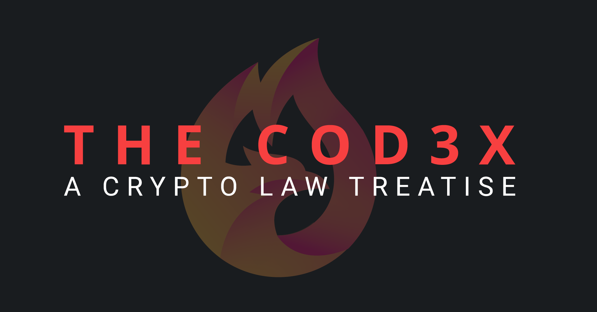

# About 🚀

<figure><figcaption></figcaption></figure>

This site has an ambitious goal: to make a legal treatise that is built for and is native to the decentralized internet. It marks a dramatic departure from traditional legal reference texts that are fixed, updated infrequently, published in (or converted from) paper, and highly inaccessible. It is the result of hundreds of hours of effort to compile, summarize, and make accessible the rapidly changing crypto regulatory landscape for lawyers and creators. To that end, this treatise will:

* update in near real time as regulations, laws, and guidance change;
* direct its users to the primary sources for their own, immediate perusal;
* cross-reference (and link) other relevant portions of itself natively to make navigation easy and intuitive;
* be natively searchable and function as a knowledge base; and
* invite any expert attorney to contribute to its pages, and all contributing attorneys will receive full attribution.

The plumbing of the international financial system is changing beneath our feet. Lawyers need to get up to speed. Creators need to understand the rails. And the two groups need to be able to have a coherent conversation. This treatise will help everyone know what the state of the law currently _is_ so that all can discuss what the law should _become_ and what we can achieve _today_.

It is my sincere hope that this tool is helpful for you. If it can be made better in anyway, please [reach out](http://twitter.com/lawtoshi). If you find it helpful, please consider sharing an article or subscribing to support its continued deployment and development.

Subscribe here to receive updates.&#x20;



