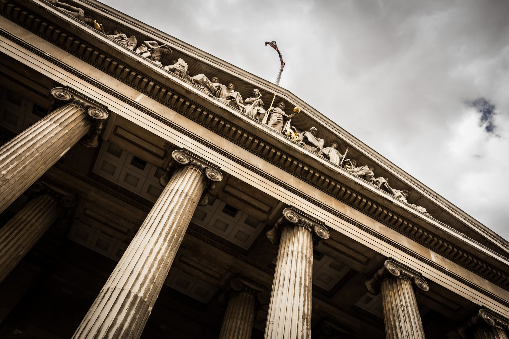

# Criminal AND Civil Insider Cryptocurrency Trading

<figure><figcaption>
Photo by <a href="https://unsplash.com/@pichler_sebastian?utm_source=ghost&#x26;utm_medium=referral&#x26;utm_campaign=api-credit">Sebastian Pichler</a> / <a href="https://unsplash.com/?utm_source=ghost&#x26;utm_medium=referral&#x26;utm_campaign=api-credit">Unsplash</a>
</figcaption></figure>

I have this dream occasionally that I will be able to wake up in the morning, drink a cup of coffee, and not worry that there are explosive developments in the world of crypto. Yesterday was not that day.

Simultaneously yesterday, the DOJ and SEC filed cases against Ishan Wahi (former Coinbase employee), his brother Nikhil Wahi, and an "associate" Sameer Ramani. Ishan and Nikhil are in custody, but their associate appears to have successfully fled to India, despite being a U.S. citizen and resident of Houston, Texas, according to the SEC.

Each case has explosive implications in its own right. Here goes.

## The Criminal Case 

Let's tackle the criminal case first, which was filed in the Southern District of New York. The DOJ alleges that the three engaged in the following scheme:

> Beginning in approximately October 2020,ISHAN WAHI worked at Coinbase as a product manager assigned to a Coinbase asset listing team. In that role, ISHAN WAHI was involved in the highly confidential process of listing crypto assets on Coinbase’s exchanges and had detailed and advanced knowledge of which crypto assets Coinbase was planning to list and the timing of public announcements about those crypto asset listings. . . . On at least 14 occasions beginning at least in June 2021 and continuing through April 2022, ISHAN WAHI knew in advance both that Coinbase planned to list particular crypto assets and the timing of Coinbase’s public announcements of those asset listings and misappropriated that Coinbase confidential information by tipping either his brother, NIKHIL WAHI, or ISHAN WAHI’s friend and associate, SAMEER RAMANI, so that they could place profitable trades in those crypto assets in advance of Coinbase’s public listing announcements. . . . Based on confidential information provided by ISHAN WAHI, NIKHIL WAHI and RAMANI collectively traded shortly in advance of at least 14 separate Coinbase public listing announcements concerning at least 25 different crypto assets.  As a result of the insider trading scheme, NIKHIL WAHI and RAMANI collectively generated realized and unrealized gains totaling at least approximately $1.5 million.

DOJ, Press Release, [_Three Charged In First Ever Cryptocurrency Insider Trading Tipping Scheme_](https://www.justice.gov/usao-sdny/pr/three-charged-first-ever-cryptocurrency-insider-trading-tipping-scheme) (2022.07.21). Digging into the [indictment](https://www.justice.gov/usao-sdny/press-release/file/1521186/download) reveals a few more salacious details:

* Ramani was allegedly much better at using this information for a profit, realizing gains of $900,000 on one trade (Indictment ¶ 13(d)), and $195,000 on another (Indictment ¶ 13(g)).
* By comparison, Ishan's brother Nikhil only managed to realize profits of $7,000 on one trade (Indictment ¶ 13(b)) and $13,000 on another (Indictment ¶ 13(f)).
* Ishan, rather than appear for an interview with Coinbase's head of security, instead "purchased a one-way ticket for a flight to New Delhi, India" and then proceeded to alert everyone under the sun that he was fleeing the country before _actually_ fleeing the country. He "falsely told Coinbase employees with whom he worked that he already had departed for India"; told Coinbase's director of security that he "had to fly back home" but could reschedule the meeting "later in the week"; and, of course, "called and texted" the other defendants "about Coinbase's investigation, and sent both of them a photograph of the messages he had received on May 11, 2022 from Coinbase's director of security operations." (Indictment ¶ 18–19.)
* Literally minutes before boarding the plane, law enforcement intercepted Ishan and "prevented \[him] from leaving the country." He had with him "an extensive array of belongings, including, among other items, three large suitcases, seven electronic devices, two passports, multiple other forms of identification, hundreds of dollars in U.S. currency, financial documents, and other personal effects and items." (Indictment ¶ 20.)

Also of note, the DOJ makes clear in this complaint (as opposed to the one against Nathaniel Chastain, initial blog post [here](https://www.thecod3x.com/no-fing-insider-trading/) and litigation tracked [here](https://www.thecod3x.com/united-states-v-chastain/)) that Coinbase is the one who got defrauded here:

> \[The defendants] participated in a scheme to deprive Coinbase of its exclusive use of confidential business information related to Coinbase's plans to list certain crypto assets on its exchanges by converting that information to their own use and relying on it to engage in profitable trades in crypto assets, in breach of ISHAN WAHI's duties of trust and confidence to Coinbase.

Not the market. Not the unwitting suckers who bought into dump. Coinbase, the multi-billion dollar cryptocurrency exchange. That is no small embarrassment for the firm, since it appears Coinbase may not even have begun investigating the conduct until a guy on Twitter who "get\[s] drunk every week on @uponlytv with a random dude from Alabama" pointed it out to them:

> Found an ETH address that bought hundreds of thousands of dollars of tokens exclusively featured in the Coinbase Asset Listing post about 24 hours before it was published, rofl [pic.twitter.com/5QlVTjl0Jp](https://t.co/5QlVTjl0Jp)
>
> — Cobie (@cobie) [April 12, 2022](https://twitter.com/cobie/status/1513874972552355846?ref\_src=twsrc%5Etfw)

(The indictment refers to the above tweet as one made by "a Twitter account that is well known in the crypto community, with hundreds of thousands of followers" (at ¶ 15)).

In any event, the indictment alleges a facially plausible breach of the wire fraud statute: there was a scheme or artifice to defraud Coinbase out of its confidential information (by Ishan Wahi violating his confidentiality agreement, and continuing to represent to the company that he was keeping the information confidential), the purpose of the scheme was to get money, and the scheme was carried out "by means of wire . . . in interstate and foreign commerce." [18 U.S.C. § 1343](https://www.law.cornell.edu/uscode/text/18/1343).

This bit about reassuring Coinbase and his fellow employees that Ishan was keeping the information confidential is interesting, because as Ira Rothken pointed out in the Nathaniel Chastain case, in the Second Circuit at least (which SDNY falls into), the intent to defraud may need to occur at the time of the agreement to keep the information confidential:

> The OpenSea employee has defense arguments against Wire Fraud. The core allegation is breach of a confidentiality agreement with OS. The 2nd Cir held-A contractual promise can only support a claim for wire fraud upon proof of fraudulent intent “at the time of” contract execution.
>
> — Ira Rothken (@rothken) [June 3, 2022](https://twitter.com/rothken/status/1532754089934655488?ref\_src=twsrc%5Etfw)

Here the DOJ alleges the following, perhaps trying to get around this precedent:

> In connection with the scheme . . . the defendant, sought to deceive Coinbase and his fellow employees by assuring them - through, among other means, Coinbase's private asset listing messaging channel (including interstate wire communications sent from ISHAN WAHI to a fellow Coinbase employee located in Manhattan, New York) - that he was maintaining the confidentiality of this information. (Indictment ¶ 11)

So, the DOJ has at least hit on all the elements of wire fraud quite clearly this time around. &#x20;

As with the case against Chastain, though, this case is novel in that it's called an "insider trading case" — which is decidedly an accurate description of the conduct at issue — but there is no explicit criminal "insider trading" statute at all, and certainly not one directed at crypto assets specifically. Instead, the DOJ is stuck(?) with the vastly broader wire fraud statute, which literally applies to any kind of fraud conducted over the internet for the purpose of getting money.

It's also interesting here that the entity being defrauded, Coinbase, is not the one who lost money. Retail traders are the only ones who likely lost money. That doesn't exactly fit the wire fraud statute, which reads that it applies to "obtaining money or property by means of false or fraudulent pretenses"; normally the person you're defrauding is the one you're extracting the money from. But not here. So it will be interesting to see if we get to see any kind of motion to dismiss briefing.

Even more broadly, the nature of the fraud in this case raises interesting questions about the scope of the wire fraud statute and what conduct is actually criminal. For example, it was clearly against confidentiality agreements for a former employee of Google to take a bunch IP with him to try to start a job at Uber using that same tech, and for substantial amounts of money. But by the logic of these cases, it would also be criminal. Although no one anticipates 100% enforcement of the criminal laws, this theory has the potential to wrap criminal law around a lot of corporate misconduct that is normally handled by civil law.

Also important here, insider trading is normally associated with insider trading of securities — i.e., stocks. There is no allegation at all in this indictment that the assets at issue are securities. The DOJ doesn't care, and it's irrelevant to the theory that there was a fraud conducted against Coinbase that enabled the defendants to get money by dumping into the market after the assets got listed on Coinbase.

In any event, Coinbase, other than with a bit of mud on its face about not catching this scheme sooner, appeared pretty supportive of the criminal prosecution on Thursday:

> Coinbase identified these individuals and provided information about them to the DOJ. Coinbase proactively monitors for illegal activity and investigates alleged misconduct.
>
> — Coinbase (@coinbase) [July 22, 2022](https://twitter.com/coinbase/status/1550273144648126465?ref\_src=twsrc%5Etfw)

As we shall see below, that differs significantly from their view of the actions the SEC took in parallel.

## The Civil Case 

Meanwhile, the SEC brought its own case in the Western District of Washington, also alleging insider trading. Let's pause on the forum for a moment. Curious that the forum the SEC chose was one far removed from its suit against Ripple, also tackling the issue of whether a crypto asset is a security. If the SEC gets an adverse ruling here it somewhat cabins the fallout to a court on the other side of the country, in a different circuit. Is the SEC trying to create a circuit split to encourage the Supreme Court to take up the issue?

Anyway, this is how the SEC characterized the case:

> The SEC’s complaint alleges that, while employed at Coinbase, Ishan Wahi helped to coordinate the platform’s public listing announcements that included what crypto assets or tokens would be made available for trading. According to the SEC’s complaint, Coinbase treated such information as confidential and warned its employees not to trade on the basis of, or tip others with, that information. However, from at least June 2021 to April 2022, in breach of his duties, Ishan repeatedly tipped the timing and content of upcoming listing announcements to his brother, Nikhil Wahi, and his friend, Sameer Ramani. Ahead of those announcements, which usually resulted in an increase in the assets’ prices, Nikhil Wahi and Ramani allegedly purchased at least 25 crypto assets, at least nine of which were securities, and then typically sold them shortly after the announcements for a profit. The long-running insider trading scheme generated illicit profits totaling more than $1.1 million.

SEC, Press Release 2022-127, [SEC Charges Former Coinbase Manager, Two Others in Crypto Asset Insider Trading Action](https://www.sec.gov/news/press-release/2022-127) (2022.07.21).

But critical for the SEC's purpose, since it is after all a securities regulator, not a criminal wire fraud enforcer, is this subsequent statement:

> "We are not concerned with labels, but rather the economic realities of an offering," said Gurbir S. Grewal, Director of the SEC’s Division of Enforcement. "In this case, those realities affirm that a number of the crypto assets at issue were securities, and, as alleged, the defendants engaged in typical insider trading ahead of their listing on Coinbase. Rest assured, we’ll continue to ensure a level playing field for investors, regardless of the label placed on the securities involved."

These statements, and the [complaint](https://www.sec.gov/litigation/complaints/2022/comp-pr2022-127.pdf) itself made Coinbase's compliance and legal teams have, to use the technical terminology, a conniption fit, which we will address in a moment.

But first the other pieces of this complaint. Generally, the conduct alleged is the same as what appears in the criminal complaint, albeit with a few extra details not worth getting into here.

Then there are 40(!) additional pages largely spent discussing exactly why 9 cryptocurrencies at issue are ... securities, and thus fall within the purview of Section 10(b) of the Exchange Act ([15 U.S.C. § 78j(b)](https://www.law.cornell.edu/uscode/text/15/78j)) and Rule 10b-5 ([17 C.F.R. § 240.10b-5](https://www.law.cornell.edu/cfr/text/17/240.10b-5)). The statute and rule there are a lot more on point for this type of conduct, because they discuss violating an obligation to keep information confidential and trading on that information for profit. So there are no uncomfortable issues about who exactly got defrauded or who lost money. They are statutes designed to keep the market fair. But key here, they only apply to _securities_.

So why does the SEC think 9 assets traded on Coinbase are securities? In the most committed interpretation the SEC has yet made to a broad definition it might later be held to (as a judicial admission), it says:

> A digital token or crypto asset is a crypto asset security if it meets the definition of a security, which the Securities Act defines to include “investment contract,” _i.e_., if it constitutes an investment of money, in a common enterprise, with a reasonable expectation of profit derived from the efforts of others. (Complaint ¶ 24)

This, of course, is just the _Howey_ test (more on that [here](https://www.thecod3x.com/sec/#howey-test)) in its most generic form, which everyone knows the SEC thinks applies to some crypto assets (but nobody knows which ones, exactly). More specifically to the 9 crypto tokens at issue, the SEC says:

> \[E]ach of the nine crypto asset securities were offered and sold by an issuer to raise money that would be used for the issuer’s business. In the offerings, the issuers directly sold crypto asset securities to investors in return for consideration (most commonly Bitcoin, Ether, U.S. dollars, or other fiat currency, or processed through the use of smart contracts). The crypto asset securities then were issued and distributed to the investors’ blockchain addresses. . . . (¶ 90)

> \[T]he issuers and their promoters solicited investors by touting the potential for profits to be earned from investing in these securities based on the efforts of others. These statements focused on, among other things, the value of the token at issue and the ability for investors to engage in secondary trading of the token, with the success of the investment depending on the efforts of management and others at the company. The issuers and their agents used websites, social media, and messaging systems to make these representations. Some issuers wrote “white papers” describing the project and promoting the offering, often in highly technical (or pseudo-technical) terms and jargon. . . . (¶ 91)

> \[T]he issuers and promoters emphasized the ability for investors to resell these tokens in the secondary markets, on platforms such as Coinbase, which was a crucial inducement to investors and essential to the market for these crypto assets securities. Investors were told, explicitly or implicitly, that they could sell their securities in the secondary markets and that the liquidity available in the secondary markets could drive up the value of their crypto asset securities. . . . (¶ 92)

> In other words, each of the nine companies invited people to invest on the promise that it would expend future efforts to improve the value of their investment. (¶ 93)

Those paragraphs may be the clearest articulation to date in a (somewhat) binding forum of what actions specifically the SEC believes will render a crypto asset a security.

The 9 tokens the SEC identified as being securities are: AMP, RLY, DDX, XYO, RGT, LCX, POWR, DFX, and KROM. The 100 paragraphs that follow allege in significant detail actions that each of the teams behind those tokens took that the SEC believes rendered the tokens securities and fit into the general statements above.

It's pretty unusual for the SEC to spend 37+ pages (of a 62 page complaint) trying to convince the court that something is a security.  But that's exactly what it did here, because the crux of its whole case hinges on the court believing it.

Also notable is that the SEC sued not the issuers of these tokens, not the exchange where they were available for sale, but ... three random nobodies who decided to insider trade these alleged securities? That's an odd enforcement decision if your goal is to protect investors and the market writ large.

But it is a good enforcement decision if your goal is to try to make case law favorable to you on what makes a crypto asset a security before bringing an enforcement action against Coinbase, with its billions of assets and hundreds of lawyers. As I've said in some other forums before, it's struck me as odd for a long time that the SEC decided to try to tackle a goliath like Ripple first when it could have spent the same (outrageous) amount of resources building up case law helpful to it by whacking smaller players. This may be an attempt to change its global litigation strategy.

The defendants might be able to drag Coinbase into this fight, though. The civil rules allow you to bring in an indispensable party under [Federal Rule of Civil Procedure 19(a)(1)](https://www.law.cornell.edu/rules/frcp/rule\_19) even if they are not a defendant brought in by the plaintiff. The defendants certainly have a good argument that Coinbase has "an interest relating to the subject of the action and is so situated that disposing of the action in \[Coinbase's] absence may . . . impair or impede \[Coinbase's] ability to protect the interest." _Id._

Coinbase may very well be a willing participant in the case given the bombshell allegations the SEC is trying to prove – without its participation – that Coinbase is essentially an unregistered securities exchange allowing at least 9 crypto asset securities to be traded on its platform. Given the concurrent criminal case, however, the civil case may be stayed for quite some time.

And the creators of the tokens at issue would have a compelling reason to participate in the case for much the same reason. If the SEC determines what they created is a security in a case that doesn't even involve them, it would be grossly unfair. We should know more in the coming weeks about how quickly this case will proceed and who will be involved in it.

## The Coinbase Petition 

Coinbase, for its part, clearly knew this suit was coming (likely due to assisting the DOJ or other back channels) and is pissed. Almost immediately with the SEC's announcement, Coinbase made its own announcement:

> 1/ We have long been calling for a workable crypto securities framework. Today, [@coinbase](https://twitter.com/coinbase?ref\_src=twsrc%5Etfw) is formalizing those calls in a petition to [@SECGov](https://twitter.com/SECGov?ref\_src=twsrc%5Etfw), requesting rules that work for digital asset securities. 🧵[https://t.co/UyB979aDwS](https://t.co/UyB979aDwS)
>
> — Faryar Shirzad (@faryarshirzad) [July 21, 2022](https://twitter.com/faryarshirzad/status/1550150874290323456?ref\_src=twsrc%5Etfw)

It's hard to fathom (for anyone outside crypto) how frustrated you'd have to be as a business to [petition](https://assets.ctfassets.net/c5bd0wqjc7v0/5NRidtW8lvwVEfSHpndWQm/78f95afa4f0ebaaefb303e1a4f172d03/Coinbase\_petition\_for\_SEC\_rulemaking.pdf) an entity that is not (yet) your regulator asking it to, pretty please, finally make a binding rule to determine what constitutes a crypto asset security so you can run your business without potentially business-ending risk at the whim of a regulator that decides to turn its sights on you. But here we are. The blog post is compelling reading, as is the petition itself. As they both point out, the SEC's enforcement-first approach to crypto has meant that it undermines its core statutory mandate of investor protection:

> Perhaps worst of all, the SEC’s approach has created enormous risk for investors. We saw this in vivid detail when the Commission brought an enforcement action against Ripple, after years of taking no action against them, claiming that XRP is a security. The value of XRP dropped immediately, costing investors huge sums of money. The XRP case is especially notable because there was disagreement even within the federal government about whether XRP was a security or not: FinCEN had determined it was not a security, and then the SEC said that it was.

And for his part, Coinbase's Chief Legal Officer, Paul Grewal, was particularly aggrieved. His tweet summary and longer blog post are also compelling reading:

> 5/ This is another example of regulation by enforcement on behalf of the SEC, which is not an effective or transparent approach to regulation. More in our blog -> [https://t.co/SaacvrZEiU](https://t.co/SaacvrZEiU)
>
> — paulgrewal.eth (@iampaulgrewal) [July 21, 2022](https://twitter.com/iampaulgrewal/status/1550256830378520577?ref\_src=twsrc%5Etfw)

## Even the CFTC Criticizes the SEC 

And in a day full of wild and unprecedented moves, sitting commissioner of the CFTC, Caroline D. Pham, joined the fray to lambast the SEC for the exact same reasons Coinbase identified—regulation by enforcement only stifles innovation and provides little in the way of meaningful guidance: &#x20;

> Read my statement on [#SEC](https://twitter.com/hashtag/SEC?src=hash\&ref\_src=twsrc%5Etfw) v. Wahi, regulation by enforcement & [#CFTC](https://twitter.com/hashtag/CFTC?src=hash\&ref\_src=twsrc%5Etfw) authority [#crypto](https://twitter.com/hashtag/crypto?src=hash\&ref\_src=twsrc%5Etfw) [#digitalassets](https://twitter.com/hashtag/digitalassets?src=hash\&ref\_src=twsrc%5Etfw) [#DAO](https://twitter.com/hashtag/DAO?src=hash\&ref\_src=twsrc%5Etfw) [pic.twitter.com/xbHvyshx8l](https://t.co/xbHvyshx8l)
>
> — Caroline D. Pham (@CarolineDPham) [July 21, 2022](https://twitter.com/CarolineDPham/status/1550159347984044033?ref\_src=twsrc%5Etfw)

The key statement from Commissioner Pham (if you can't read the image) is this:

> The SEC's allegations could have broad implications beyond this single case, underscoring how critical and urgent it is that regulators work together. Major questions are best addressed through a transparent process that engages the public to develop appropriate policy with expert input—through notice-and-comment rulemaking pursuant to the Administrative Procedure Act. Regulatory clarity comes from being out in the open, not in the dark.

To say this is unusual is a gross understatement. It is, in essence, a shot across the bow from a fellow regulator appointed by the same President. And the point is clear: the SEC is picking winners and losers in a bizarre way that doesn't involve any of the industry participants actually creating the instruments at issue in the case, and paradoxically is actually harming investors.

Each of these commentaries goes to the heart of what the structure and purpose of federal regulation should be. And each concludes that what the SEC is doing is not just counterproductive, but actively harmful. &#x20;
