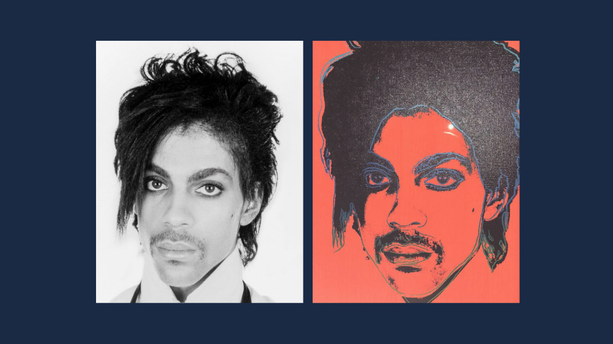

# Jurisdictional and Other Legal Considerations in the Booming NFT Market

<figure><figcaption>
Comparison of Goldsmith's photograph of Prince (left) and Andy Warhol's work (right). Did Warhol infringe on Goldsmith's copyright?
</figcaption></figure>

_\[Editor's Note: This post comes courtesy of_ [_Kevin Kelly_](https://www.linkedin.com/in/kevin-kelly-esq/)_, a fine art lawyer and commercial litigator in New York City who has a passion for NFTs. Unlike most crypto and web3 lawyers, he is still at a firm and accepting clients! Given the_ [_significant legal issues_](https://www.thecod3x.com/otherdeeds-part-1/) _NFTs pose, artists and project coordinators would be well served by reaching out to competent counsel sooner than later.]_

Many purists think decentralization is the most important promise of cryptocurrency, but to grow in popularity, non-fungible tokens (NFTs) need to guarantee rights to artists. NFTs are non-interchangeable units of data stored on a blockchain, that can be sold and traded. NFTs can represent real-world items, such as artwork. Currently, some artists are hesitant to enter the NFT space fully because they lack certainty as to how legal rights will be enforced in a decentralized space. For example, if there is a dispute, how would one handle it? When people only hear about the scams or “getting rugged,” they will be wary of entering into the NFT market. (“Getting rugged” is a widely used term for investing in an NFT project where the artists/managers of the project promise the moon, but then “pull the rug out from under you” by taking your money and never developing the project).

Courts have not yet determined how to treat NFTs. Will artists be able to enforce copyright? What if someone claims stealing an image is free use, but they barely changed the original artwork? Since an NFT is a combination of an image and a token, should we treat them the same or differently? Some people in the NFT community believe there should be some regulation, while others say that there should be none, since NFTs are supposed to be completely decentralized. There may be answers in traditional art law, but artists (and art law attorneys who counsel them) cannot be certain how courts will handle disputes involving NFT art law. Many in the NFT community feel this uncertainty is a non-issue. For them, it is more about the thrill of a sale and being on the cutting edge of new technology and art. Yet other artists are waiting for certainty before they fully commit to NFTs.

### “FOMO” (the Fear Of Missing Out) 

Once the legal rights surrounding NFT art become more certain, more artists will become involved, but they may be too late and miss the rush. “FOMO” (the “Fear of Missing Out”) certainly exists in the NFT space, but missing the frantic rush is okay. While it is still early in the development of NFTs, we are now in the stage where more legal structure has been implemented.

NFTs are most likely around to stay. Sotheby’s and Christie’s accept bids in cryptocurrency, Twitter is incorporating NFT verification for profile pictures, companies are creating NFTs of their own brands, and Lloyd’s of London is using the proprietary Appraisal Bureau Method to appraise NFTs for full liability insurance. Now that institutions are entering the rush, the market will become more regulated because large institutions seek certainty and regulation creates more certainty.

### Jurisdiction 

Getting into court to enforce NFT rights may prove challenging. Under the United States Constitution, the jurisdiction of the United States includes territories and territorial waters. [_Gonzales v. Williams_](https://casetext.com/case/gonzales-v-williams-4), 192 U.S. 1, 24 S. Ct. 177 (1904)_._ However, with a decentralized network, a predicate issue arises: how does a court determine it has jurisdiction over a NFT case? The decentralized nature of the blockchain and the pseudo-anonymity associated with “wallet addresses” gives rise to the question whether any transactions occurred in a particular jurisdiction.

For example, if an artist in New York City creates a series of NFTs and applies for copyright protections in the United States, but someone copies the NFTs in a country with different copyright protections, what can the New York City artist do?

The OpenSea “Terms and Conditions” that users agree to for that NFT online marketplace platform state:

> These Terms and your access to and use of the Service shall be governed by and construed and enforced in accordance with the laws of the State of New York (without regard to conflict of law rules or principles of the State of New York, or any other jurisdiction that would cause the application of the laws of any other jurisdiction). Any dispute between the parties that is not subject to arbitration as set forth in Section 16 or cannot be heard in small claims court, shall be resolved in the state or federal courts of New York County in the State of New York, and the United States, respectively, sitting in the State of New York.

[OpenSea Terms of Service](https://opensea.io/tos) (last visited March 24, 2022). __ So, on OpenSea, users agree to abide by the laws of New York, but that does not necessarily subject you to the jurisdiction of courts in New York for legal actions other than between OpenSea and you. Mere use of a website is insufficient to establish “minimum contacts,” and sustaining jurisdiction based upon allegations that such use satisfies the minimum contacts test would offend “traditional notions of fair play and substantial justice.” _See_ [_Int’l Shoe Co. v. Washington_](https://casetext.com/case/international-shoe-co-v-state-of-washington-office-of-unemployment-compensation-and-placement), 326 U.S. 310, 316, 66 S. Ct 154, 158 (1945) (quoting [_Milliken v. Meyer_](https://casetext.com/case/milliken-v-meyer)_,_ 311 U.S. 457, 463, 61 S. Ct. 339, 343 (1940)).

Selling NFTs on OpenSea does not and should not open someone up to the jurisdiction of a United States court, and various courts across the country are wrestling with whether they have jurisdiction in a decentralized system. Courts are attempting to figure out what constitutes “minimum contacts” in the crypto and NFT space. For example, California courts have even held that early discovery is not permitted to determine the location of various cryptowallets used to store cryptocurrency and/or NFTs. A district court in California has previously found that it did not have good cause to order early discovery to identify the owners of crypto wallets as the plaintiff failed to show that the complaint could withstand a motion to dismiss generally because there was not a sufficient basis to conclude that there was personal jurisdiction over the defendants. [_Strobel v. Lesnick_](https://casetext.com/case/strobel-v-lesnick), No. 21-cv-01010-LB, 2021 U.S. Dist. LEXIS 216803, at \*4-5 (N.D. Cal. Aug. 13, 2021). Further, California courts require that there be purposeful direction towards California.

Recently, a California district court granted a motion to dismiss where the defendant had allegedly distributed an app-based videogame that was a “blatant clone” of the plaintiff’s copyrighted videogame. _See_ [_Good Job Games Bilism Yazilim Ve Pazarlama A.S. v. SayGames LLC_](https://casetext.com/case/good-job-games-bilism-yazilim-ve-pazarlama-as-v-saygames-llc), 458 F. Supp. 3d 1202, 1205 (N.D. Cal. May 7, 2020). In relevant part, the court held that “\[t]he mere availability of downloading \[the infringing content] in California, by itself, does not create personal jurisdiction.” _Id._ at 1207. The allegedly infringing game in _Good Job Games_ had “no specific focus in California; the app-based videogame is not about California or anything in/from California.” _Id._ at 1209. None of the defendant’s advertisements were directed at California or even mentioned the state. The court also noted that there was no evidence that the downloads of the infringing game were “concentrated in California,” and that there were no allegations that there was “anything unique about the California-consumer market” that directed the defendant’s activities to that forum. _Id._ at 1210.

However, the Ninth Circuit summarily reversed the district court and remanded for discovery on jurisdiction because "\[t]he question of jurisdiction in the Internet age is not well-settled" and “the record is insufficiently developed to resolve personal jurisdiction.” [_Good Job Games Bilism Yazilim Ve Pazarlama A.S. v. Saygames, LLC_](https://casetext.com/case/good-job-games-bilism-yazilim-ve-pazarlama-as-v-saygames-llc-1), No. 20-16123, at \*1 (9th Cir. Dec. 10, 2021). The remanded case is still pending.

### Enforcement 

A New York City artist could sue in federal court, get a default judgment for copyright infringement, subpoena information regarding the cryptowallet selling the infringing NFTs, and then try to enforce the judgment in the foreign country; however, even large copyright owners have had trouble enforcing judgments in foreign countries due to differing copyright laws.

The wrinkle of NFTs is that their decentralized nature can cause an interesting interplay of international law and make jurisdiction difficult for courts to determine. We are still in the early stages of NFTs, so the rules are still developing.

### Copyright and Fair Use 

Other legal issues presented by NFTs continue. In traditional art law, copyright is key. Under the Copyright Act of 1976, artists and authors receive copyright protections in the original and any derivative works. While art generally builds on and borrows from those before it, copyright protects artist’s intellectual property, but also permits others to reference it through fair use. The four main factors are: the purpose and character of the use, the nature of the copyrighted work, the amount and substantiality of the portion used in relation to the copyrighted work as a whole, and the effect of the use upon the potential market for or value of the copyrighted work. [17 U.S.C. § 107.](https://www.law.cornell.edu/uscode/text/17/107) The relevant factor for NFTs is whether minting an NFT can be considered “transformative.” Various transformative uses are permissible such as “criticism, comment, news reporting, teaching…, scholarship, or research.” _Id_. Placing works in a different context, adding a new expression, meaning, or message, or adding new aesthetics can constitute transformative use; however, even “derivative works generally involve transformations in the nature of _changes of form.”_ [_Authors Guild v. Google, Inc_](https://casetext.com/case/guild-v-google-inc-1)_.,_ 804 F.3d 202, 215-16 (2d Cir. 2015). Further, works that “merely present ‘the same material but in a new form’ without ‘add\[ing] something new’” are still considered derivative works. [_Andy Warhol Found. for the Visual Arts, Inc. v. Goldsmith,_](https://casetext.com/case/andy-warhol-found-for-visual-arts-inc-v-goldsmith-1) 11 F.4th 26, 39 (2d Cir. 2021) quoting [_Cariou v. Prince,_](https://casetext.com/case/cariou-v-prince-2) 714 F.3d 694, 708 (2d Cir. 2013).

While [_Warhol v. Goldsmith_](https://casetext.com/case/andy-warhol-found-for-visual-arts-inc-v-goldsmith-1) has changed the fair use analysis for traditional art, we are still awaiting insight into how the courts will view NFTs — are they the image itself or the code that links to the image? Is the NFT itself merely a link to artwork since the NFT can change the image that is connected to it or is the NFT the image itself? There are arguments for both interpretations so, for now, it depends on the facts.

### Conclusion 

As art lawyers, we have an idea of how traditional art law will apply to NFTs; however, litigators in particular should watch closely to see how the courts handle NFTs.

_**This post is not subject to the Cod3x's CC BY 4.0 license. © 2022 Kevin Kelly.**_

