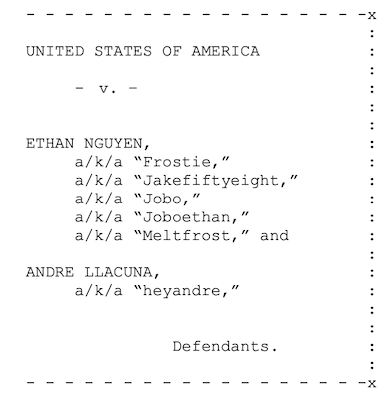
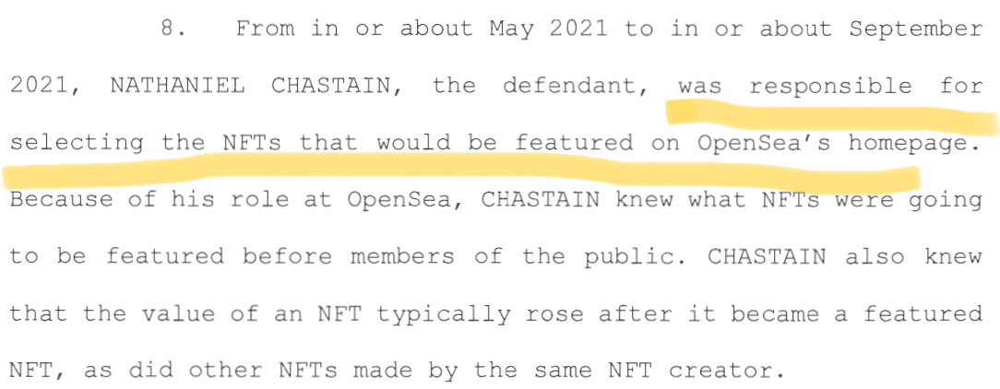

# No F'ing (Insider) Trading

The oldest thing in the world is money. The second oldest is fraud to get money. And the DOJ in the course of barely two months is setting the stage to clean house among an aspect of crypto that has been riddled with what almost everyone acknowledges as blatant pump and dumps, rug pulls, and fraudulent activity based on information asymmetry: NFTs.

This was the mood in NFT twitter less than 24 hours _before_ the DOJ announced its latest prosecution effort:

> WAGMI is bullshit — in fact, very few are “gunna make it” & here’s why 🧵👇🏽\
> \
> Sneak peak:\
> \- the house always wins, but who’s the “house”? 🎰\
> \- insider trading, rug pulls, scam, exploitation\
> \- how “winner takes most” is only amplified here\
> \
> You don’t wanna miss this 🍿⤵️
>
> — riddles.eth 🇨🇦 (@ethernaz) [June 1, 2022](https://twitter.com/ethernaz/status/1531846299426881536?ref\_src=twsrc%5Etfw)

So, when people are talking about it this openly, it's really not that surprising that criminal prosecutions are starting to flow. Fraud committed over the internet has been a crime for a long time now. Let's take a look at how the DOJ is expanding two traditional tools to tackle fraud to the NFT space: the Frosties rug pull and the recent indictment of Nathaniel Chastain for insider trading through his position at OpenSea.

## Frosties 

On March 24, 2022 the DOJ [announced](https://www.justice.gov/usao-sdny/pr/two-defendants-charged-non-fungible-token-nft-fraud-and-money-laundering-scheme-0) it had arrested and charged two individuals in connection with the "Frosties" NFT rug pull. According to the DOJ, the two 20-year-olds, Ethan Nguyen and Andre Llacuna, had marketed Frosties with all kinds of extravagant promises about the future usefulness of the NFTs (giveaways! early access to a metaverse game! exclusive mint passes! sound familiar?), to great success – the NFT mint sold out quickly in January 2022. Within hours of the mint finishing, however, Nguyen and Llacuna allegedly transferred the $1.1 million in sale proceeds to their personal wallets and shut down the Frosties website completely.  They then started building another alleged rug pull called Embers which was set to launch two days before the duo was arrested.

Apparently enough people complained about this rug pull that the DOJ took it seriously and swiftly investigated, identified the individuals behind the online personas marketing Frosties, arrested them, and charged them. We need to pause here to see what the complaint caption looked like, because normally you only see this kind of thing in "sovereign citizen" type cases:

<figure><figcaption></figcaption></figure>

The legal theory behind the charges is not anything novel; this conduct, the DOJ says, amounted to conspiracy to commit wire fraud and conspiracy to commit money laundering. It's a conspiracy because there were two people coordinating their efforts. It's wire fraud ([18 U.S.C. § 1343](https://www.law.cornell.edu/uscode/text/18/1343)) because, allegedly, Nguyen and Llacuna:

* willfully and knowingly devised a scheme and artifice to defraud;
* for the purpose of obtaining money and property by means of false and fraudulent pretenses, representations, and promises; and
* used wire communication in interstate commerce for the purpose of executing the scheme to defraud.

And they committed money laundering ([USC § 1956(a)(1)(A)(i)](https://www.law.cornell.edu/uscode/text/18/1956)), allegedly, because they used the proceeds of their wire fraud to further commit wire fraud.

This all seems like a relatively straightforward application of wire fraud and money laundering. You can't make outlandish promises about something you have _no intention_ of ever honoring just to get people to give you money, and then use the proceeds of that fraud to commit more fraud, no matter how cute your Frosties or Embers are. &#x20;

## Nathaniel Chastain 

Yesterday, however, the DOJ [arrested and charged](https://www.justice.gov/usao-sdny/pr/former-employee-nft-marketplace-charged-first-ever-digital-asset-insider-trading-scheme) Nathaniel Chastain, a former OpenSea executive who resigned in the midst of a [huge controversy](https://blockworks.co/openseas-nate-chastain-calls-it-quits-after-insider-trading-allegations/) last year. Back in September 2021, some folks scanning the public blockchain discovered a strange pattern: Chastain's wallets appeared to be buying NFTs shortly _before_ they were listed on OpenSea's homepage when the price was low and selling them shortly _after_ they were listed as the prices went up due to increased exposure. That was particularly problematic because Chastain himself was responsible for choosing what got listed on the homepage.

Nine months later, the DOJ charged Chastain with crimes for this alleged activity. What crimes? The very same wire fraud and money laundering as in the Frosties case! It thus appears the DOJ is expanding the application of "wire fraud" in the very straightforward sense above (false promises in exchange for money) to what many people online are calling "insider trading."

That term is usually [applied](https://www.investor.gov/introduction-investing/investing-basics/glossary/insider-trading) in the context of buying or selling public company securities on the basis of material, non-public information that (usually) allows the person exploiting the information to profit handsomely from a stock dropping or soaring. Doing so is very plainly illegal under Section 10(b) of the Exchange Act ([15 U.S.C. § 78j(b)](https://www.law.cornell.edu/uscode/text/15/78j)) and Rule 10b-5 ([17 C.F.R. § 240.10b-5](https://www.law.cornell.edu/cfr/text/17/240.10b-5)).

Equally plainly, those are _not_ the charges the government has brought against Chastain here. It's just good old wire fraud and money laundering. But the government _calls_ it insider trading in the first line of the complaint. As Dave Lund aptly pointed out on twitter, "the law is not an ass," and if you are doing something that _sounds_ wrong, clever lawyers will probably find a way to hold you accountable and make it _actually_ wrong:

> 1/ My contracts professor used to say, "the law is not an ass." A number of people who did things that they felt were wrong, but which they thought were not prohibited (or detectable) are going to find that out the hard way. Today's lesson comes from US v Chastain.
>
> — Dane Lund (@lund\_dane) [June 1, 2022](https://twitter.com/lund\_dane/status/1532068931787116547?ref\_src=twsrc%5Etfw)

In this case it's government lawyers, and they are pushing to apply traditional wire fraud principles to a new situation: using inside information to sell NFTs at the right time for profit. Normally fraud requires some active representation or statement that other people rely on to their detriment. So just having inside information and exploiting it to strategic advantage in an open market of other people buying and selling the same asset doesn't exactly fit the normal fraud framework, because there's no representation or false pretense – it's just an offer to buy or sell an asset at a certain price.

But Chastain did not just "have" inside information that he then used to strategic advantage. The indictment alleges he actually was responsible for selecting which NFTs would be featured on OpenSea's homepage:

<figure><figcaption></figcaption></figure>

This allegation is likely the lynchpin of the government's fraud case because it's how they can meet the "false and fraudulent pretenses, representations, and promises" element of wire fraud. What the government is arguing here is that if you (1) have specific control over a public marketplace; (2) secretly buy things you _know_ are about to be listed on that marketplace in a very prominent way; and (3) are actually _the person_ responsible for choosing what gets prominently listed, then it is a fraudulent pretense you have created that permits you to exploit that knowledge by buying low right before the listing and then dumping the NFTs right after the listing for profits of 2X-5X what you paid.

It certainly sounds like a fraud you are committing against an unwitting public who believes they are seeing the listings and buying amongst a group of other people who are seeing the listings on the homepage at the same time.

The government also highlights two other facts to suggest Chastain's conduct was fraudulent. First, that this conduct was specifically in violation of a confidentiality agreement Chastain had with OpenSea that prevented him from using confidential information "except for the benefit of OpenSea." Breaching a contract isn't normally enough to get you to fraud, but when your breach enables you to exploit unwitting buyers based on a situation you have created, it seems a lot closer. Second, the government alleges Chastain tried to conceal what he was doing by using anonymous accounts to funnel the proceeds of his sales.

It's far too early to say if the government's theory of wire fraud here will be successful, but it has a lot of intuitive appeal. If the government can get the case to a jury, and successfully explain what happened here, this case could be a very tough to successfully defend. &#x20;

Note, however, this case doesn't mean the government thinks NFTs are securities, at least for purposes of this novel "insider trading" complaint. Nor are the facts of this case necessarily easy to translate to a lot of other contexts, since Chastain held such a key position that enabled the alleged fraud on the market.

However, it should certainly give pause to influencers and project creators who buy assets for low values and then intentionally create a lot of hype around those assets __ and then take advantage of that hype to dump their own recently acquired holdings on other buyers. If this theory of "insider trading" holds water, such conduct could be criminal and carry stiff monetary penalties in addition to an up to 20 year prison term for each offense. _Caveat venditor_.

### &#x20;
