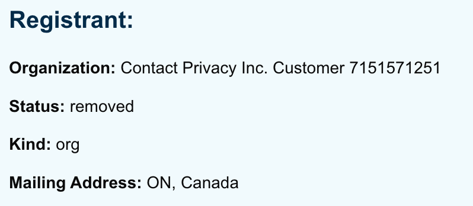
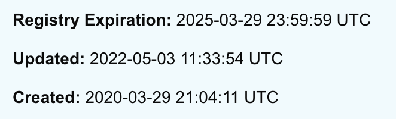

# Otherdeeds Part 1: Are They Securities?

<figure><figcaption>
Photo by <a href="https://unsplash.com/@nampoh?utm_source=ghost&#x26;utm_medium=referral&#x26;utm_campaign=api-credit">Maxim Hopman</a> / <a href="https://unsplash.com/?utm_source=ghost&#x26;utm_medium=referral&#x26;utm_campaign=api-credit">Unsplash</a>
</figcaption></figure>

Yuga Labs and Animoca released the most anticipated NFTs of 2022 (perhaps in history) on April 30, 2022. As they are not simply art and have substantial terms and conditions from two different companies attached to them, the NFTs pose significant questions about their legal status and the legal implications for consumers who purchased them. This two-part series will address:

1. whether, based on current guidance from the SEC, the SEC is likely to consider Otherdeeds securities; and
2. what litigation and enforceability issues may arise from the standard terms the minters agreed to, and secondary market buyers may be subject to.

**Disclaimer before attempting to address those questions: I am a lawyer, but I am not your lawyer. This is my opinion based on my reading of the law and SEC guidance. The SEC and a court may disagree with me, in whole or in part. Do not make financial or legal decisions based on what you read here. Consult your own attorney or financial advisor. I have no affiliation with Animoca or Yuga, but I did try to participate in the public mint but failed – not enough ETH to pay the gas fees. Yuga refunded me 0.066239856ETH in gas for the failed transaction. As of writing, I still hold 614.87680809 $APE.**

The short answer for Part 1: Unclear. The U.S. securities laws may not even apply to Otherdeeds. If they did, the SEC would probably argue Otherdeeds are securities. But there are significant issues the SEC would have to overcome in any enforcement action. Let's get into the details of why, but first, some basic background facts we can apply to the relevant legal framework.

## The Mint and the Terms 

### The Mint 

To mint an Otherdeed, an individual had to meet numerous requirements:

* Go through a Know-Your-Customer (KYC) process that required presenting a valid, government issued ID, during a limited window of time. This process did not involve any income/asset verification. Remember this, it's important later.
* Accumulate ApeCoin ($APE) to actually purchase the Otherdeeds. The day before the mint, @OthersideMeta announced that it would require 305 $APE per Otherdeed, and that only two per wallet would be allowed. 55,000 Otherdeeds were available to mint through KYC'd wallets.
* Pre-approve the KYC'd wallet on the [Otherside.xyz](http://otherside.xyz/) website so that the mint site could withdraw $APE from the wallet.
* Have sufficient ETH to pay the gas fees associated with the minting. (It ranged between 1.7-3.5ETH during the \~2.5 hours of minting.)

Assuming an individual met all these requirements, they would successfully mint either one or two Otherdeeds per KYC'd wallet they owned.

The terms of use on the Otherside.xyz site,  the NFT purchase agreement, and the Otherdeed / Koda license agreement were not available until shortly before the mint began.  These are multi-page documents with predictably dense legalese, buried at the bottom of the page in what looks like size negative 3 font:

<figure><figcaption></figcaption></figure>

When a user clicked the purchase an NFT button during the mint, they had to agree explicitly to the NFT Purchase Agreement. Prior to the mint, @OthersideMeta provided the following FAQs regarding the mint:

* [Otherside FAQs](https://mirror.xyz/0x3ae401F245034dAe25af1e2f9b9Bb8F006b1Dc6e/KTV2I78zxscFW0emuVvG9cv7Df7Aag4cOsmP2fwKT70) on Mirror.xyz
* [Dutch Auctions Are Actually Bullshit](https://mirror.xyz/0x3ae401F245034dAe25af1e2f9b9Bb8F006b1Dc6e/ErZMh-0TTwMrAKPJ1hlDcjvNfZvQ998G-B-oTS6BVQk) on Mirror.xyz

Given the constraints of the Ethereum blockchain's ability to process transactions, minting of the 55,000 Otherdeeds lasted roughly 2.5 hours. Some users requested to mint towards the beginning with high gas limits, some waited to see and then upped the gas offer later, others simply waited for gas prices to level out around 2ETH for the majority of the mint. (Over US$100M in gas alone was used during the mint. 🤯)

Finally, the 55,000 supply available for minting is not the total supply. It's only half. Yuga reserved 15,000 Otherdeeds to itself, Bored Ape Yacht Club and Mutant Ape Yacht Club owners are allowed to claim another 30,000 for free (plus gas), and Yuga will give another 10,000 Koda NFTs to lucky Otherdeed land owners. All told, the supply in this ecosystem is currently 110,000, including all Otherdeeds and Kodas.

### The Agreements 

Here are links to the relevant agreements:

* [Terms & Conditions](https://otherside.xyz/terms)
* [NFT Purchase Agreement](https://otherside.xyz/nft-purchase-agreement)
* [Otherdeed Terms & Koda License Agreement](https://otherside.xyz/license)

Let's take a look at some of the key provisions in each one that could impact the question of whether these NFTs are an "investment contract."

#### The Terms & Conditions 

The Terms & Conditions govern the use of the Otherside.xyz website. It is a pretty standard clickwrap agreement, but it doesn't really have any terms that are relevant for the securities analysis since it does not appear to govern anything directly to do with the Otherdeed or Koda NFTs.

#### NFT Purchase Agreement 

This one is where the rubber hits the road. This agreement is _only_ with Animoca (technically "Vantage Top Group Limited"), not Yuga, and of course is for the purchase of the Otherdeed itself.

In any event, during the minting process, purchasers had to affirmatively agree to this purchase agreement by checking a box and hitting accept. Secondary market purchases on OpenSea / LooksRare won't see this agreement unless they seek it out.

Here are the major terms relevant to the securities analysis:

* mandatory arbitration of any disputes through the Hong Kong International Arbitration Centre, sets jurisdiction in Hong Kong, and governing law as Hong Kong;
* says what you are really buying is only a "non-fungible token (NFT) (i.e., a controllable electronic record recorded on a blockchain)" that comes with _**no**_ "Access Rights . . . as of the time of purchase"
  * Ownership gives you the right to "freely sell, transfer, or otherwise dispose of that Otherdeed" but you get "\[n]o other rights of any kind or nature with respect to the Otherdeed or any image or other intellectual property associated with, related to, or linked to, an Otherdeed."
* However, your right to freely sell/transfer the Otherdeed is subject to your agreement not to transfer it to anyone "who is designated or specified under regulations made under the Sanctions and Anti-Money Laundering Act 2018 (Chapter 13) of the laws of England and Wales."
* Makes the purchaser agree that they are buying it for "artistic purposes only" meaning "for personal enjoyment purposes," and "**is not purchasing any Otherdeed with the with the intent or expectation of profits from any appreciation in value or otherwise from the Otherdeed or any Access Rights that may from time to time be granted by Animoca or third parties.**"

And finally...

#### Otherdeed Terms / Koda License Agreement 

This agreement is between Yuga and the owner/purchaser of a Koda. It's not clear yet how the Kodas that exist "on" some of the Otherdeeds are going to come into play. Per this agreement, Yuga is in charge of them, but no one minted a Koda, just the land through an agreement with Animoca, although Kodas do appear visually on the land. Here's an example:

<figure><figcaption></figcaption></figure>

Per the Koda License Agreement, there will be 10,000 Koda NFTs. Presumably these get distributed to the 10,000 Otherdeed owners that have the matching Koda. And once that happens, the Kodas themselves will have an owner, or a secondary market purchaser. At that point, these terms kick in. And here are the key provisions:

* Defines the Koda NFT as "a non-fungible, unique token on the Ethereum blockchain" that "as of its genesis issuance, contains an image of Art"
* The "Art" is defined as "each of the unique images of the 10,000 'kodas' each associated with, and linked to, an individual Koda NFT."
* Provides the purchaser / owner with personal property rights to the Koda, meaning the owner can "freely sell, transfer, or otherwise dispose of that Koda," but reiterates the owner has no intellectual property rights in the Art.
* Prohibits sales/transfers to anyone in a country designated by the U.S. as subject to an embargo or as a terrorist supporting country, or is explicitly listed on a U.S. government list of restricted parties. (This is an obvious reference to [OFAC](http://thecod3x.com/ofac/) and its list of Specially Designated Nationals.)
* Details the terms of the license you actually have as a Koda owner. This includes:
  * Non-commercial license to the Art, i.e., printing it out, using it as a PFP or an avatar in a web3 enabled site. The license is revocable, however, which meaning Yuga can take it back whenever they want.
  * Full commercial use of the art, i.e., any merchandising, branding based on the Koda, displaying it in metaverses, and the right to any income derived from these uses. This license is also revocable.
  * Both uses include the right to create derivative works.
* Says you get no rights to the trademarks in Kodas.

Now that the stage is set, let's take a look at whether these agreements collectively constitute an "investment contract."

## Are Otherdeeds Securities?

My assumption going into this was that it would be a straightforward application of U.S. securities laws to the facts. I was wrong.

### U.S. Securities Laws May Not Even Apply 

There is a threshold issue to address first: do U.S. securities laws even apply to the sale of Otherdeeds? Otherdeeds were _only_ sold by Animoca, not Yuga. Animoca appears to be a Hong Kong entity with its office located, per its website, at Unit 417-421, Cyberport 1, 100 Cyberport Road, Pokfulam, Hong Kong. The NFT Purchase Agreement also states the agreement is governed by Hong Kong law and any disputes must be resolved in Hong Kong. Yuga, for its part, appears to be "gifting" 10,000 Kodas to lucky Otherdeeds purchasers / claimers. Thus Yuga, a U.S. company, isn't selling anything.

This is really quite clever legal structuring. That is especially true because it comes literally one month after a U.S. District Court in the Southern District of New York, the most likely venue for any enforcement action, ruled that the Securities Act has territorial limits that prevented a consumer class action against the crypto exchange Binance. _See_ [_JD Anderson v. Binance_](https://casetext.com/case/jd-anderson-v-binance), No. 1:20-cv-2803, at \*6–7 (ALC) (S.D.N.Y. 2022.03.31).

As the court there explained, U.S. “securities laws apply to those 'transactions in securities listed on domestic exchanges, and domestic transactions in other securities.'" _Id._ (quoting [_Morrison v. Nat'l Austl. Bank Ltd._](https://casetext.com/case/morrison-v-national-australia-bank#p267), 561 U.S. 247, 267 (2010)). Moreover, just buying a security (assuming it is a security) in the U.S. through the internet is not sufficient to make it a "domestic transaction" that would trigger the U.S. securities laws. _Id._ at 7 ("trade not considered domestic on the basis that the purchaser 'places a buy order in the United States for the purchase of foreign securities on a foreign exchange'" (quoting [_City of Pontiac Policemen's & Firemen's Ret. Sys. v. UBS AG_](https://casetext.com/case/city-of-pontiac-policemens-firemens-ret-sys-v-ubs-ag#p187), 752 F.3d 173, 187 (2d Cir. 2014))).

If that analysis holds up, Otherdeeds are not subject to U.S. securities laws regardless of whether they might fit the definition of a security pursuant to those laws. Full stop.

But the minting process actually occurred on Otherside.xyz, which is _Yuga_'s website. So even though the NFT Purchase Agreement is between what are likely many U.S. purchasers and Animoca, the SEC might have a pretty good argument the transaction itself was actually domestic — if it could prove Otherside.xyz is a U.S. website. But that's not a slam dunk, because apparently it was registered in Canada back in March 2020:

<figure><figcaption></figcaption></figure>

<figure><figcaption></figcaption></figure>

Moreover, the _Binance_ court also said, helpfully for Animoca, that "third-party servers and third parties' choices of location are insufficient to deem Binance a national securities exchange." [_JD Anderson v. Binance_](https://casetext.com/case/jd-anderson-v-binance), No. 1:20-cv-2803, at \*7 (ALC) (S.D.N.Y. 2022.03.31). This is not what you call an open and shut enforcement case.

But let's assume for a moment the SEC comes up with a clever argument to get around the extraterritoriality defense — something along the lines of Yuga and Animoca are essentially a joint venture for this project, so Yuga's U.S. contacts should be counted against Animoca.  Are these NFTs securities if U.S. law applies to them?

To do this analysis, we have to apply two tests. First the _Howey_ test from the U.S. Supreme Court. Second, the [SEC](https://thecod3x.com/sec/)'s limited guidance in the form of its FinHub department's [_Framework for “Investment Contract” Analysis of Digital Assets_](https://www.sec.gov/corpfin/framework-investment-contract-analysis-digital-assets) (2019.04.03) (the "framework").

### The Howey Test 

Established by the U.S. Supreme Court, the _Howey_ test requires an analysis of four key parts of any arrangement to determine whether it is an "investment contract" (a term used by the Securities Act of 1933) and thus a security. A court will ask if the arrangement involves:

1. an investment of money
2. in a common enterprise
3. with an expectation of profits
4. from the efforts of others.

[_SEC v. Howey Co._](https://casetext.com/case/sec-v-howey-co), 328 U.S. 293, 298–99 (1946). (Coincidentally, this case involved the sale of citrus grove land in Florida.)

The first prong is easily met, at least for the minters who agreed to pay 305 – 610 $APE for their Otherdeeds. But that only accounts for 50% of the existing supply of NFTs in this ecosystem. Of the existing 100,000 Otherdeeds, 55,000 were purchased during the mint; the other 45,000 were reserved for Yuga (15,000) or Bored Ape / Mutant Ape holders (30,000). And then there are another 10,000 Koda NFTs that are apparently tied to 10% of the Otherdeeds.

For the Bored Ape / Mutant Apes who simply had to claim their Otherdeeds, they couldn't get them without purchasing their ape and paying gas fees to make the claim, but arguably they essentially got them for free and thus there was no "investment of money," just the fee you would have to pay to make any transaction on the Ethereum blockchain happen, which neither Yuga nor Animoca receive. There's a similar issue with the Kodas which are going to be distributed by Yuga, a separate company, apparently for free based on who owns the Otherdeeds. And, perhaps not accidentally, with the addition of 10,000 "free" Kodas to the Otherside ecosystem, there is a 50/50 split between NFTs that were paid for and those that were "free."

55,000 people clearly made the investment of money required to meet this prong of the test. But Yuga/Animoca can argue the fact that a full 50% of the available supply involved no investment of money, and that supply is also owned by a broad swath of consumers, changes the calculus because it would require saying the NFTs are a security only half the time. This is another clever move to make an enforcement action harder.

The common enterprise prong is easily met. Yuga and Animoca are working with a growing pool of employees to create this project, the art, the NFTs, and the forthcoming utility in a MMO MetaRPG game. This is very clearly a "common enterprise." Almost no one who is buying these NFTs has the skillset to try to create what Yuga and Animoca are attempting, nor do they want to. The whole point is the buyer does next to nothing while Yuga and Animoca build the project and create value.

The third prong, expectation of profits, starts to get more challenging. Animoca, in the Otherdeed NFT Purchase Agreement, made minters agree they are

> not purchasing any Otherdeed with the with the intent or expectation of profits from any appreciation in value or otherwise from the Otherdeed or any Access Rights that may from time to time be granted by Animoca or third parties.

The thing is, the Supreme Court in _Howey_ itself said it doesn't matter what you _say_ it matters what you _do_, and just agreeing you have no expectation of profits is wholly unlikely to move the needle for a court evaluating whether the reality of the arrangement involves an expectation of profits. _See S.E.C. v. Howey Co._, 328 U.S. 293, 300 (1946) (legal test looks to how the economic reality of how the arrangement functions “regardless of the legal terminology in which such contracts are clothed.”).

Thus a court is more likely to look at what's happening on the ground. Lots of people paid many thousands of dollars for a jpeg of some land, with the promise that it will be useful in a game to be released at some unknown time in the future. There is an active marketplace for those jpegs that is \~2X the price to mint as of writing, and in most cases many multiples more. "The art is amazing" is not a rational justification for why people are spending these sums of money on art _before they could even see it_, much less use it for gaming.

The more plausible explanation is that most people minted Otherdeeds precisely because they hoped to profit from the purchase. Indeed, that seems the only rational explanation for the crushing demand to participate in the mint itself. That explanation will be bolstered by a lengthy digital record from 20,000+ purchasers talking about making an investment, the price mooning, the gas fees being worth the flip, and so on.

Okay, but people can be idiots. They do crazy things that make no rational sense, and spend thousands of dollars on rare shoes. Shoes are not securities. And the Otherdeeds contract makes totally clear you basically can't do anything with it other than print it out or set it as your profile picture on social media, or "display" it in a non-commercial use. It's hard to see how anyone could expect to profit from that arrangement. This prong is debatable.

Last prong — solely from the efforts of others. It appears Otherdeeds are meant to involve the direct, personal involvement of the owners in the game Yuga / Animoca are creating. According to Otherside's website, "\[r]ather than a static representation of a piece of land, your Otherdeed is designed to evolve along _**with what you choose to do in the game**_."  Yuga has also given Koda owners a full commercial license, suggesting that it's up to them to realize a profit from the Koda, or not, based on their own efforts.

Those facts might weigh against finding Otherdeeds/Kodas are securities, but there's a problem — none of that is possible now, so there is literally no way any purchaser can participate in anything other than buying the Otherdeed NFT. No one can harvest resources on the land, use the Koda associated with it, or anything else that's part of the Otherside roadmap. The Koda NFTs do not appear to exist yet. The only thing a purchaser _can_ do with an Otherdeed is sell it to someone else who wants to buy it. (Remember, no commercial use for Otherdeeds.) So, by default, everything is based on the efforts of Yuga and Animoca, not the owner of the Otherdeed / Koda. In their current form, the fourth and final prong is likely met under the _Howey_ test.

All told, there are tough questions on the first and third prongs of the _Howey_ test, and it's not clear to me how a court would interpret these nuances in this context. Result: unclear.

### FinHub's Test 

That's not the end of the story, though. FinHub issued its [guidance](https://www.sec.gov/corpfin/framework-investment-contract-analysis-digital-assets) on digital assets that has a whole host of factors to consider in this space. In typical fashion, the SEC disclaims this guidance applies outside of FinHub, so it's not clear if or how the Enforcement Division will apply them, but it's a worthwhile starting point.

The factors are a lengthy list, so rather than repeat it we'll walk through each factor simultaneously with the analysis. FinHub's guidance pretty much assumes the first two factors of _Howey_ (investment of money in a common enterprise) will always be met and so focuses on what would trigger a conclusion that the investment had an expectation of profits based on the efforts of others, so this won't help us answer the problems identified above with the "investment of money" issue.

Important for this analysis is FinHub's definition of an "Active Participant" or "AP," which it defines as a "promoter, sponsor, or other third party (or affiliated group of third parties)" who "provides essential managerial efforts that affect the success of the enterprise."

Let's run through each of the factors FinHub says you should consider.

#### Based on the Efforts of Others 

* "Does the purchaser reasonably expect to rely on the efforts of an AP?"
  * Yes. The purchaser is not building the metaverse the NFT will be used in.
* "Are those efforts 'the undeniably significant ones, those essential managerial efforts which affect the failure or success of the enterprise,' as opposed to efforts that are more ministerial in nature?"
  * Yes. Yuga and Animoca are building a MetaRPG game at significant effort that is the whole point of these NFTs. This is the exact opposite of being "ministerial in nature." The fact that the MetaRPG hasn't been released yet is a significant fact under FinHub's factors:

> Where the network or the digital asset is still in development and the network or digital asset is not fully functional at the time of the offer or sale, purchasers would reasonably expect an AP to further develop the functionality of the network or digital asset (directly or indirectly). This particularly would be the case where an AP promises further developmental efforts in order for the digital asset to attain or grow in value.

* "There are essential tasks or responsibilities performed and expected to be performed by an AP, rather than an unaffiliated, dispersed community of network users . . . ."
  * Yes. Yuga and Animoca are doing all the work here. It is centralized in them, the purchasers add nothing (other than demand and money).
* "An AP creates or supports a market for, or the price of, the digital asset. This can include, for example, an AP that: (1) controls the creation and issuance of the digital asset; or (2) takes other actions to support a market price of the digital asset, such as by limiting supply or ensuring scarcity, through, for example, buybacks, "burning," or other activities."
  * Yes. Yuga and Animoca are in total control of the creation and issuance of the Otherdeeds and Kodas and intentionally capped the supply and control the distribution.
* "An AP has a lead or central role in the direction of the ongoing development of the network or the digital asset. In particular, an AP plays a lead or central role in deciding governance issues, code updates, or how third parties participate in the validation of transactions that occur with respect to the digital asset."
  * Yes. The agreements specifically control how third parties can participate, become owners of the NFTs, and gives Yuga/Animoca the ability to invalidate transactions that violate the NFT Purchase Agreement or Koda License Agreement.
* "An AP has a continuing managerial role in making decisions about or exercising judgment concerning the network or the characteristics or rights the digital asset represents\[.]"
  * Yes. Yuga and Animoca set forth detailed agreements about what rights each NFT includes and does not. Other applicable subfactors under this one include the fact that Yuga / Animoca "arranged . . . the trading of the digital asset on a secondary market"; have exclusive control over "who will receive additional digital assets and under what conditions"; are in sole control of "how to deploy funds raised from sales of the digital asset"; and "Making other managerial judgements or decisions that will directly or indirectly impact the . . . value of the digital asset generally."
* "Purchasers would reasonably expect the AP to undertake efforts to promote its own interests and enhance the value of the . . . digital asset\[.]"
  * Yes. Everyone expects Yuga and Animoca to develop a MetaRPG.

#### Reasonable Expectation of Profits 

* "The digital asset gives the holder rights to share in the enterprise's income or profits or to realize gain from capital appreciation of the digital asset."
  * There hasn't been any suggestion yet that Otherdeed or Koda holders are going to get income directly or share any profits of the Otherside project. However, it seems pretty plain holders have the rights "to realize gain from capital appreciation of the digital asset," which FinHub says applies particularly when it results from the AP's "operation, promotion, improvement, or other positive developments in the network, particularly if there is a secondary trading market that enables digital asset holders to resell their digital assets and realize gains." Shortly before the mint took place, OpenSea announced it was ready to launch the secondary market for Otherdeeds and that users could use $APE to purchase Otherdeeds, so this factor applies:

> See you on the Otherside in t-minus 4 hours 👀\
> Bring your [$APE](https://twitter.com/search?q=%24APE\&src=ctag\&ref\_src=twsrc%5Etfw) or ETH [@OthersideMeta](https://twitter.com/OthersideMeta?ref\_src=twsrc%5Etfw) [pic.twitter.com/8fz54WVw5k](https://t.co/8fz54WVw5k)
>
> — OpenSea (@opensea) [April 30, 2022](https://twitter.com/opensea/status/1520508693758062592?ref\_src=twsrc%5Etfw)

* "The digital asset is transferable or traded on or through a secondary market or platform, or is expected to be in the future."
  * Yes.
* "Purchasers reasonably would expect that an AP's efforts will result in capital appreciation of the digital asset and therefore be able to earn a return on their purchase."
  * Maybe. Clearly most people do expect this and that's why demand was so high going into the mint. But there's also the argument it's all speculation and therefore devoid of any "reasonable" expectation of appreciation. Moreover, the Otherdeeds agreement grants vanishingly little license to do anything with the NFT, so it's also hard to explain why the value should increase over time.
* "The digital asset is offered broadly to potential purchasers as compared to being targeted to expected users of the goods or services or those who have a need for the functionality of the network."
  * This one probably leans in favor of not being a security. Although Otherdeeds had a significant supply for an NFT mint (55k), it is pretty small and was at least arguably targeted to people who want to use the Otherdeeds to participate in the MetaRPG Yuga/Animoca are creating, particularly because the mint was limited to two per wallet, and thus was not "offered and purchased in quantities indicative of investment intent instead of quantities indicative of a user of the network."
* "There is little apparent correlation between the purchase/offering price of the digital asset and the market price of the particular goods or services that can be acquired in exchange for the digital asset."
  * A few days after the mint, the only corelation between the current market price and the mint price seems to be that no one is willing to sell for less than the gas paid during the mint. As of writing, the floor price sits at about 3.7ETH (and on a downward trend). There is thus little relationship between purchase (mint) price and market price for the NFT, so this factor favors it being a security.
* "There is little apparent correlation between quantities the digital asset typically trades in (or the amounts that purchasers typically purchase) and the amount of the underlying goods or services a typical consumer would purchase for use or consumption."
  * This one probably doesn't apply yet, since we have no idea how the Otherdeeds will be used, so it's not clear how many the typical consumer would need to participate in the MetaRPG.
* "The AP has raised an amount of funds in excess of what may be needed to establish a functional network or digital asset."
  * Top tier video games usually cost $40 million+ to develop (source: [Wikipedia](https://en.wikipedia.org/wiki/List\_of\_most\_expensive\_video\_games\_to\_develop)), with the top two costing over $300 million. Yuga [claimed](https://twitter.com/OthersideMeta/status/1518734004022919168) that all $APE used in minting would be "locked up for one year" though, so the funds raised can't actually be used for development. However, Animoca receives royalties on sale of the Otherdeeds, so it does stand to have funds coming in for development purposes—just not from the initial purchase, and the 5% royalty fee on sales will be only a small fraction of the $335 million in $APE raised during the sale (\~$20 $APE price \* 305 $APE \* 55,000 NFTs). This one is probably neutral or favors not being a security.
* "The AP is able to benefit from its efforts as a result of holding the same class of digital assets as those being distributed to the public."
  * Yes. Yuga specifically [reserved](https://twitter.com/OthersideMeta/status/1520870572825194497) 15,000 Otherdeeds to itself.
* "The digital asset is marketed, directly or indirectly, using" methods indicating it is an investment, for the purpose of raising funds, etc. (there are eight factors).
  * No. I'm not aware of any actions Yuga and Animoca have taken to market Otherdeeds as an investment, that it is raising funds to use for development, or to emphasize appreciation in value of the Otherdeeds. This one favors Otherdeeds not being a security.

### Factors Weighing Against Being a Security 

FinHub next offers a series of factors that would indicate a digital asset is _not_ a security. Let's walk through those as well.

* "The . . . digital asset \[is] fully developed and operational."
  * Clearly not. They are for use in a MetaRPG forthcoming and an unknown date.
* "Holders of the digital asset are immediately able to use it for its intended functionality on the network, particularly where there are built-in incentives to encourage such use."
  * Also not applicable, for the same reason.
* "The digital assets' creation and structure is designed and implemented to meet the needs of its users, rather than to feed speculation as to its value or development of its network. For example, the digital asset can only be used on the network and generally can be held or transferred only in amounts that correspond to a purchaser's expected use."
  * Although distribution was limited to 2 per KYC'd wallet, there is no use case right now for Otherdeeds — except speculative trading on the secondary market. This facor dos not support finding Otherdeeds are not securities.
* "Prospects for appreciation in the value of the digital asset are limited."
  * Maybe. The Otherdeeds purchase agreement severely limits a holder's rights, so that is a good argument for why it should not become more valuable over time based on anything Yuga/Animoca do. However, Yuga/Animoca did not take any other steps to limit appreciation suggested by FinHub, such as designing Otherdeeds so that their "value will remain constant or even degrade over time."
* "With respect to a digital asset that represents rights to a good or service, it currently can be redeemed within a developed network or platform to acquire or otherwise use those goods or services."
  * Nope.
* "Any economic benefit that may be derived from appreciation in the value of the digital asset is incidental to obtaining the right to use it for its intended functionality."
  * Other than a promised future use, there is no utility for Otherdeeds right now. So the appreciation in value right now is pure speculation untethered to the rights granted by the NFT.
* "The digital asset is marketed in a manner that emphasizes the functionality of the digital asset, and not the potential for the increase in market value of the digital asset."
  * This one favors finding Otherdeeds are not securities. Yuga/Animoca have clearly said Otherdeeds are for use in a MetaRPG. They have never hyped the potential gains that could be realized from ownership.
* "Potential purchasers have the ability to . . . use (or have used) the digital asset for its intended functionality."
  * Nope.
* "Restrictions on the transferability of the digital asset are consistent with the asset's use and not facilitating a speculative market."
  * No. Although the NFT Purchase Agreement and Koda License Agreement each purport to limit transfers to non-terrorists/money launderers, as a practical matter there are no restrictions on transfers as a matter of code built into the smart contract. The whole market for Otherdeeds _is_ speculative.
* "If the AP facilitates the creation of a secondary market, transfers of the digital asset may only be made by and among users of the platform."
  * Nope. Despite the speculation Yuga might limit sales/transfers on the secondary market to $APE, or create their own market, neither happened.

## What does it mean? 

To recap:

* It's quite possible U.S. securities laws do not apply at all to the Otherdeeds sales;
* Even if those laws do apply, there are problems on two of the four prongs of the _Howey_ test (investment of money and expectation of profits).
* Applying the FinHub framework:
  * 19 of the factors weigh in favor of finding Otherdeeds are securities.
  * 7 of the factors weigh against or are neutral toward finding Otherdeeds are securities.

If the SEC can resolve the territorial/jurisdictional issues in its favor, it seems _extremely_ likely that the SEC would conclude Otherdeeds are securities applying its current FinHub framework, although it's not clear — at all — a court would agree with that interpretation or weight the factors in the SEC's favor given the paucity of case law in this area. And the one clearly applicable case favors Animoca, not the SEC, on the threshold issue of whether U.S. securities laws even apply.

If I were the SEC, this is not the test case I would want to bring to start building a helpful body of case law on the NFTs-are-securities theory. Too many issues, too much sophistication and money in the defense, too long to a result.
