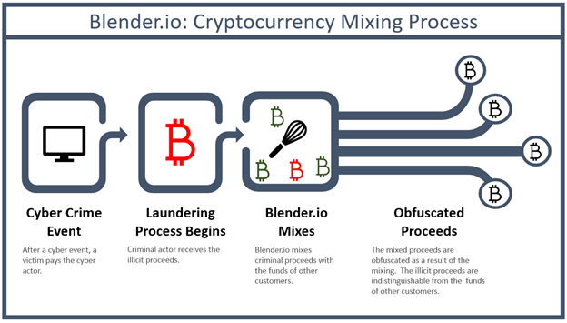
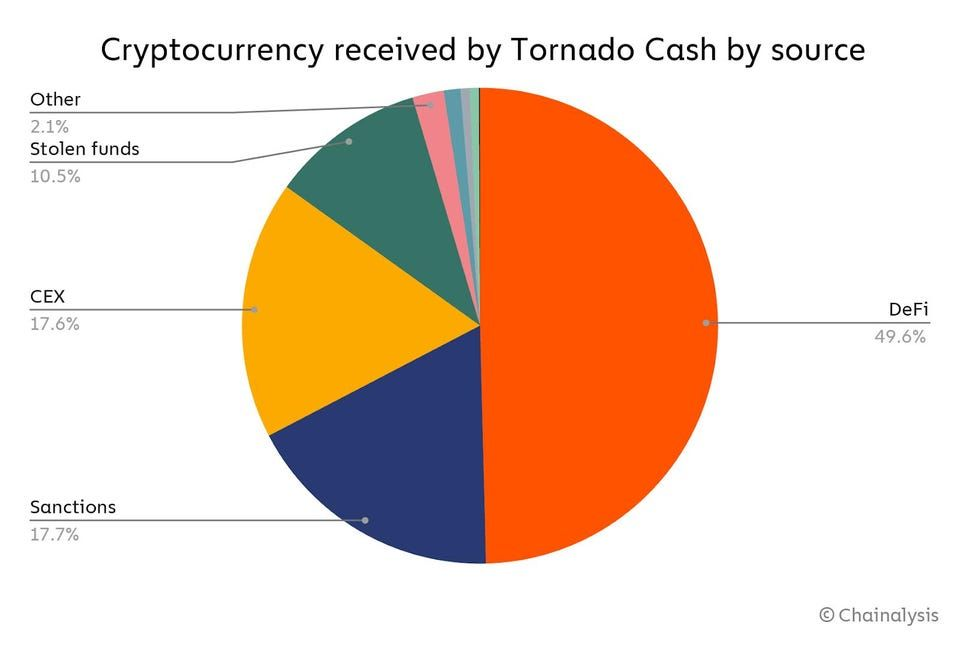

# 1.24 - Office of Foreign Assets Control (OFAC)

## Overview 

The Office of Foreign Asset Control is a component of the Department of the Treasury, and operates under the Office of Terrorism and Financial Intelligence. It implements, administers, and enforces sanctions issued to protect U.S. national security and foreign policy. In carrying out that mission, it can impose penalties and fines, freeze assets, and bar parties from operating in the United States. It can also make referrals to the Department of Justice for criminal prosecution.

It is perhaps most well known among financial services firms for maintaining the Specially Designated Nationals and Blocked Persons List (SDN List) that provides a complete list of individuals, entities, and nations with whom it is illegal to transact, designations which it is permitted to make — and which carry the force of law — pursuant to the International Emergency Economic Powers Act (IEEPA), [50 U.S.C. §§ 1701–06](https://www.law.cornell.edu/uscode/text/50/1701), or the Trading with the Enemy Act (TWEA), [50 U.S.C. §§ 4301–41](https://www.law.cornell.edu/uscode/text/50/4301), and more recently, [Executive Order 13694](https://www.federalregister.gov/documents/2015/04/02/2015-07788/blocking-the-property-of-certain-persons-engaging-in-significant-malicious-cyber-enabled-activities), as amended by [Executive Order 13757](https://www.federalregister.gov/documents/2017/01/03/2016-31922/taking-additional-steps-to-address-the-national-emergency-with-respect-to-significant-malicious).

Although perhaps lesser known than agencies like the [SEC](https://www.thecod3x.com/sec/), [CFTC](https://www.thecod3x.com/cftc/), or [FinCEN](https://www.thecod3x.com/fincen/), it has become increasingly more involved in enforcement actions to protect U.S. interests domestically and abroad by identifying specific virtual currency addresses that are barred from transacting, and more recently, sanctioning an entire exchange and multiple virtual currency mixers. Understanding OFAC's role in the financial infrastructure of the United States is critical for crypto industry players who do business internationally to any extent or who have customer accounts that may attempt to interact with individuals or entities identified on OFAC's SDN list.

## Specially Designated Nationals and Blocked Persons List (SDN) 

The SDN List is the comprehensive list of all individuals, entities, geographic regions, and countries that OFAC has designated as actors with which U.S. persons may not transact with for any reason. Designation on the list also extends the prohibition to entities that are owned, directly or indirectly, 50% or more by blocked persons. Once OFAC has made the designation, it is immediately illegal to make any contribution or provision of funds, goods, or services by, to, or for the benefit of any blocked person or entity or to receive any contribution or provision of funds, goods, or services from any such person.

Violations of these prohibitions come with strict liability — it does not matter if an individual intends to violate the sanctions or is even aware of them. The simple act of carrying out a transaction with a blocked person or entity potentially carries significant civil fines and criminal penalties. _See_ [50 U.S.C. § 1705](https://www.law.cornell.edu/uscode/text/50/1705). It is thus absolutely critical for digital asset businesses to understand how these sanctions work and to have a plan for complying with them to avoid crushing fines and penalties, potentially levied not just against the business but against individual executives directly.

### Virtual Currency Addresses 

OFAC began its focus on designating terrorist and criminal enterprises engaged in virtual currency activity in late 2018. Those efforts began by targeting specific virtual currency addresses and creators of cryptocurrencies blatantly used for criminal purposes:

* Designating two Iranian individuals who helped launder funds through the SamSam ransomware and their associated bitcoin addresses. OFAC, Press Release, [Treasury Designates Iran-Based Financial Facilitators of Malicious Cyber Activity and for the First Time Identifies Associated Digital Currency Addresses](https://home.treasury.gov/news/press-releases/sm556) (2018.11.28)
* Designating two North Korean individuals and their bitcoin addresses associated with the Lazarus Group involved in hacking multiple cryptocurrency exchanges. OFAC, [Treasury Sanctions Individuals Laundering Cryptocurrency for Lazarus Group](https://home.treasury.gov/news/press-releases/sm924) (2020.03.02)
* Designating a Chinese individual who launched cryptocurrencies to further criminal enterprises across Southeast Asia. OFAC, [Treasury Sanctions Corrupt Actors in Africa and Asia](https://home.treasury.gov/news/press-releases/sm1206) (2020.12.09)
* Designating ten individuals and two entities associated with Iran’s Islamic Revolutionary Guard Corps (IRGC), and associated bitcoin addresses, for their role in ransomware attacks. OFAC, Press Release, [Treasury Sanctions IRGC-Affiliated Cyber Actors for Roles in Ransomware Activity](https://home.treasury.gov/news/press-releases/jy0948) (2022.09.14)

### Specific Entities / Markets 

It then expanded from individual actors/addresses to entire cryptocurrency enterprises:

* Designating SUEX OTC, a virtual currency exchange, that OFAC found had been involved in laundering eight different ransomware schemes, which resulted in over 40% of SUEX's known transaction history to be associated with illicit actors. OFAC, Press Release, [Treasury Takes Robust Actions to Counter Ransomware](https://home.treasury.gov/news/press-releases/jy0364) (2021.09.21)
* Designating the darknet market Hydra and 100 associated virtual currency addresses, as well as virtual currency exchange Garantex, both operating out of Russia. OFAC, Press Release, [Treasury Sanctions Russia-Based Hydra, World’s Largest Darknet Market, and Ransomware-Enabling Virtual Currency Exchange Garantex](https://home.treasury.gov/news/press-releases/jy0701) (2022.04.05)

### Virtual Currency Mixers 

More recently, the efforts have increased significantly in intensity by sanctioning not just particular entities or virtual wallet addresses, but protocols known as virtual currency mixers. The mixers are designed to allow transactions to occur anonymously on public blockchains by obscuring the origin and destination of particular amounts of funds. While stemming from the same goals as all of OFAC's other actions, these more recent actions pose vexing questions, including constitutional questions.‌

<figure><figcaption></figcaption></figure>

The first sanctioned mixer was Blender.io, a mixer operating on the bitcoin blockchain. OFAC, Press Release, [U.S. Treasury Issues First-Ever Sanctions on a Virtual Currency Mixer, Targets DPRK Cyber Threats](https://home.treasury.gov/news/press-releases/jy0768) (2022.05.06). OFAC found that Blender.io had helped transfer more than $500 million worth of bitcoin since the protocol was created in 2017, and played a critical role in helping the North Korean-sponsored Lazarus Group process over $20.5 million in proceeds from the Axie Infinity hack.

This initial move by OFAC drew little objection from most observers, perhaps because Blender.io was a custodied protocol with central control. Thus sanctioning of the software was a proxy for the custodians who (presumably) refused to cooperate in changing the protocol to achieve compliance.

Three months later, OFAC sanctioned Tornado Cash, a highly popular decentralized currency mixer protocol operating on the Ethereum blockchain. OFAC, Press Release, [U.S. Treasury Sanctions Notorious Virtual Currency Mixer Tornado Cash](https://home.treasury.gov/news/press-releases/jy0916) (2022.08.08); OFAC, Press Release, [Treasury Designates DPRK Weapons Representatives](https://home.treasury.gov/news/press-releases/jy1087) (2022.11.08) (re-designating Tornado Cash with clarifying FAQ 1095, see below). The rationale behind this sanction was similar; OFAC concluded the mixer had "been used to launder more than $7 billion worth of virtual currency since its creation in 2019" which included "$455 million stolen by the Lazarus Group," "$96 million of . . . funds derived from the June 24, 2022 Harmony Bridge Heist, and at least $7.8 million from the August 2, 2022 Nomad Heist."

This sanction proved to be far more controversial, although not for a reason acknowledged by OFAC itself in its press release. Almost immediately, industry groups protested the sanction as an attack on decentralized protocols generally, which are not controlled by any one person or entity. Hailey Lennon commented:

> OFAC merely identified a URL and a series of Ethereum contract addresses. Sanctioning a tool and noncustodial smart contract address that are not a direct alias of any person meriting sanction is substantively different from typical usage of the SDN list," and appeared to fail to acknowledge Treasury's own "clear guidance \[via FinCEN] in 2019 \[that] stressed the important difference a custodial wallet (hosted) and a noncustodial wallet (unhosted).

Hailey Lennon, [_Treasury Sanctions Against Major Crypto Privacy Tool Pose New Risks to the Industry_](https://www.forbes.com/sites/haileylennon/2022/08/09/treasury-sanctions-against-major-crypto-privacy-tool-pose-new-risks-to-the-industry/?sh=4a04bd834658) __ (2022.08.09).

Expanding on that point, Coin Center argued:

> If a contract is credibly decentralized then the original authors of that contract could be hit by a bus and the service would continue to work. As such, today’s action does not seem so much a sanction against a person or entity with agency. It appears, instead, to be the sanctioning of a tool that is neutral in character and that can be put to good or bad uses like any other technology. . . . It is a ban on a technology and not a sanction against a person.

Jerry Brito & Peter Van Valkenburgh, [_U.S. Treasury sanction of privacy tools places sweeping restrictions on all Americans_](https://www.coincenter.org/u-s-treasury-sanction-of-privacy-tools-places-sweeping-restrictions-on-all-americans/) (2022.08.08). They noted that restrictions on the ability to use a neutral tool for purposes of spending money may involve significant First Amendment concerns.

As others have noted, if there are not legitimate tools in place to spend money anonymously, this could stifle meritorious free speech, access to medical services like abortion, or otherwise legal businesses that bear a social stigma like pornography. As crypto adoption accelerates, solving the balance between privacy and national security will become more critical.

Chainalysis also noted that despite the significant sums, stolen funds made up only 10.5% of the cryptocurrency moved through Tornado Cash. Chainalysis, [_OFAC Sanctions Popular Ethereum Mixer Tornado Cash for Laundering Crypto Stolen by North Korea's Lazarus Group_](https://blog.chainalysis.com/reports/tornado-cash-ofac-designation-sanctions/) __ (2022.08.08).

<figure><figcaption></figcaption></figure>

The move by OFAC to sanction the decentralized protocol thus appears to cut off nearly 90% of legitimate funds being moved through an anonymizing tool. In apparent protest of the sanction, one anonymous Twitter user claimed to be sending small amounts of ETH to hundreds of high profile wallets like Coinbase CEO Brian Armstrong and TV host Jimmy Fallon in a practice that became known as "dusting."

> Been accumulating a pretty big list of major CT users ETH addresses and their .ens official addresses\
> \
> Withdrawing .1 ETH to all of them from tornado throughout the rest of the day
>
> — depression BTC (@depression2019) [August 8, 2022](https://twitter.com/depression2019/status/1556748494622208000?ref\_src=twsrc%5Etfw)

Despite the industry outcry, until OFAC alters or removes the designation, all U.S. individuals and businesses must be extremely careful in their compliance programs to avoid inadvertent or technical violations of the sanction. Developers of protocols — whether centralized or not — should also take into consideration how compliance features will work to avoid a similar outcome for their work.

On September 13, 2022, OFAC released [a set of additional FAQs](https://home.treasury.gov/policy-issues/financial-sanctions/faqs/added/2022-09-13) (see [below](ofac.md#tornado-cash)) to address some of the issues raised by sanctioning the Tornado Cash addresses. Those FAQs left open certain issues, including what exactly OFAC defines as "Toranado Cash," which it writes about as though it is an entity controlled by individuals. There are problems with thinking of Tornado Cash in those terms, as Alex Wade, Michael Lewellen, and Peter Van Valkenburgh of Coin Center have explained in their article [_How does Tornado Cash work?_](https://www.coincenter.org/education/advanced-topics/how-does-tornado-cash-work/)

The FAQs further leave open what exactly OFAC considers a "transaction" with the Tornado Cash addresses (i.e., is validating/mining a block with transactions in it also a prohibited transaction itself?) and how that definition may impact the base layer of blockchains like Bitcoin and Ethereum. But they do clarify that simply publishing the source code for Tornado Cash is not prohibited, nor would be "discussing, teaching about, or including open-source code in written publications, such as textbooks, absent additional facts." _See_ [FAQ 1076](https://home.treasury.gov/policy-issues/financial-sanctions/faqs/1076) and [1077](https://home.treasury.gov/policy-issues/financial-sanctions/faqs/1077).

[FAQ 1078](https://home.treasury.gov/policy-issues/financial-sanctions/faqs/1078) addresses the "dusting" issue above, but takes the position that sanctions compliance is still required of individuals who were "dusted," although OFAC clarifies enforcement against these individuals will not be a priority. Compliance for dusted individuals is thus technically still necessary for the foreseeable future.

[FAQ 1079](https://home.treasury.gov/policy-issues/financial-sanctions/faqs/1079) does, however, provide a clear path for individuals with assets currently stuck in Tornado Cash to obtain a license from OFAC to withdraw those assets, provided they share with OFAC "all relevant information regarding these transactions with Tornado Cash, including the wallet addresses for the remitter and beneficiary, transaction hashes, the date and time of the transaction(s), as well as the amount(s) of virtual currency." If those conditions are met, OFAC opines that it will "have a favorable licensing policy towards such applications."

On November 8, 2022, OFAC simultaneously removed the Tornado Cash designation and re-designated it, largely with the same Ethereum addresses, and released an additional FAQ. OFAC, Press Release, [Treasury Designates DPRK Weapons Representatives](https://home.treasury.gov/news/press-releases/jy1087) (2022.11.08) (re-designating Tornado Cash with clarifying FAQ 1095, see [below](ofac.md#tornado-cash)). The additional FAQ defines what person or entity specifically had been sanctioned, an apparent indirect response to Coin Center's lawsuit against Treasury challenging OFAC's sanctioning of immutable smart code contract code and not against an actual entity. _See_ [_Coin Center v. Yellen_](https://www.courtlistener.com/docket/65418276/coin-center-v-yellen/)_,_ 22-cv-20375 (N.D. Fla. 2022) (Court Listener). The [FAQ](https://home.treasury.gov/policy-issues/financial-sanctions/faqs/1095) clarifies that the sanctions are levied against the

> entity known as Tornado Cash, which is a “partnership, association, joint venture, corporation, group, subgroup, or other organization” that may be designated pursuant to IEEPA. Tornado Cash’s organizational structure consists of: (1) its founders and other associated developers, who together launched the Tornado Cash mixing service, developed new Tornado Cash mixing service features, created the Tornado Cash Decentralized Autonomous Organization (DAO), and actively promoted the platform’s popularity in an attempt to increase its user base; and (2) the Tornado Cash DAO, which is responsible for voting on and implementing new features created by the developers.

This explanation still leaves open many questions about sanctioning smart contracts, what the permissible uses are of the underlying code of the sanctioned addresses, and whether or how individuals transacting on public distributed ledgers can legally shield their transactions from public view.

## Enforcement 

Placing individuals and entities (or their aliases) on the SDN List is only the first step. OFAC also has significant enforcement authority to fine entities that violate its sanctions. It has used that authority twice in the crypto space, levying significant fines.

In the most recent, it fined BitPay (through a settlement) $507,375 for 2,102 violations of multiple sanctions programs. OFAC, Enforcement Release, [OFAC Enters Into $507,375 Settlement with BitPay, Inc. for Apparent Violations of Multiple Sanctions Programs Related to Digital Currency Transactions](https://home.treasury.gov/system/files/126/20210218\_bp.pdf) (2021.02.18). OFAC found that BitPay had allowed individuals located in the sanctioned territories of Crimea, Cuba, North Korea, Iran, Sudan, and Syria to transact with merchants in the United States "even though BitPay had location information, including \[IP] addresses and other location data, about those persons prior to effecting the transactions."

The fine is particularly notable in that it is nearly five times the "$129,000 worth of digital currency-related transactions with BitPay's merchant customers" that violated the sanctions. The agency "emphasize\[d] that OFAC obligations apply to all U.S. persons, including those involved in providing digital currency services." Crypto services should also take note that simply screening the SDN List is not sufficient for full compliance. Rather, full-field awareness of user data is necessary to ensure ongoing compliance.

Its prior fine (also via settlement) resulted from similar conduct by BitGo, which had failed to prevent users in sanctioned territories from using its "hot wallet" secure digital wallet management service despite having IP addresses that should have alerted BitGo of the location. OFAC, Enforcement Release, [OFAC Enters Into $98,830 Settlement with BitGo, Inc. for Apparent Violations of Multiple Sanctions Programs Related to Digital Currency Transactions](https://home.treasury.gov/system/files/126/20201230\_bitgo.pdf) (2020.12.30).

There were 183 apparent violations resulting in a settlement of $98,830; the transactions themselves were valued at only $9,127.79. This apparently was a mitigated penalty based on BitGo's significant cooperation with OFAC and implementation of an OFAC Policy, appointing a chief compliance officer, and screening all accounts against the SDN List.

## Guidance 

OFAC's guidance for the crypto / virtual currency industry consists primarily of a lengthy PDF released in late 2021. OFAC, [Sanctions Compliance Guidance for the Virtual Currency Industry](https://home.treasury.gov/policy-issues/financial-sanctions/recent-actions/20211015) (2021.10.15). That guidance provides a general overview of OFAC compliance considerations that apply to all individuals and organizations. It then goes on to detail specific efforts OFAC believes the virtual currency industry should take, including:

* SDN list and geographic screening;
* Developing a culture of sanctions compliance, particularly at the senior management level, supported by adequate resources, including a dedicated compliance officer;
* Implementing a sanctions compliance plan "during the testing and review process so that sanctions compliance can be accounted for as technologies are being developed and prior to launching a new product";
* Conducting routine (and perhaps ongoing) risk assessments "to identify potential sanctions issues the company is likely to encounter";
* Making use of all data available about users to effect compliance — including, e.g., IP addresses provided on login not just initial registration, and related geolocation tools;
* Transaction monitoring of both historical and ongoing transactions, both for apparent violations and to fully inform the risk assessment;
* Know Your Customer (KYC) procedures that collect detailed information about individuals and entities "during onboarding and throughout the lifecycle of the customer relationship."
* Depending on the individual/entity, this could include "examining customer transaction history for connections to sanctioned jurisdictions _**or transactions with virtual currency addresses that have been linked to sanctioned actors.**_" (emphasis added). OFAC also advises that:

> \[V]irtual currency companies may consider conducting a historic lookback of transactional activity after OFAC lists a virtual currency address on the SDN List to identify connections to the listed address. A lookback could also identify connections to unlisted addresses that have previously transacted with the listed address, as such unlisted addresses could also pose sanctions risk depending on the nature of those transactions. Companies in the virtual currency industry may consider deploying blockchain analytics tools that help identify and mitigate these sanctions risks.

The guidance provides many additional details for implementing an effective OFAC compliance program and crypto industry compliance officials should closely parse its suggestions.

OFAC has also taken an aggressive position against paying ransomware payments, which usually demand payment through virtual currency. OFAC, [Updated Advisory on Potential Sanctions Risks for Facilitating Ransomware Payments](https://home.treasury.gov/system/files/126/ofac\_ransomware\_advisory.pdf) (2021.09.21). It advises against agreeing to make such payments wherever possible due to the national security interests at stake and because "there is no guarantee that companies will regain access to their data or be free from further attacks themselves." _Id._ at 3. If such payments must be made, however, it advises that immediately contacting OFAC and related agencies may mitigate any enforcement action OFAC might otherwise bring. _Id._ at 5.

Compliance officers may wish to familiarize themselves with OFAC's enforcement guidelines as part of their own enterprise risk assessments. [31 C.F.R. § 501 App'x A](https://www.ecfr.gov/current/title-31/subtitle-B/chapter-V/part-501/appendix-Appendix%20A%20to%20Part%20501).

## FAQs 

OFAC has issued a number of short, plain language frequently asked questions, with easy to follow answers on a number of basic but essential compliance topics. They are organized by category below and are best read directly from the source.

### Digital Currency Basics 

* OFAC, FAQ 559, [For purposes of OFAC sanctions programs, what do the terms "digital currency," "digital currency wallet," "digital currency address," and "virtual currency" mean?](https://home.treasury.gov/policy-issues/financial-sanctions/faqs/559) (2021.10.15)
* OFAC, FAQ 646, [How do I block digital currency?](https://home.treasury.gov/policy-issues/financial-sanctions/faqs/646) (2021.10.15)
* OFAC, FAQ 594, [Is it possible to query a digital currency address using OFAC’s Sanctions List Search tool?](https://home.treasury.gov/policy-issues/financial-sanctions/faqs/594) (2021.05.18)
* OFAC, FAQ 563, [What is the structure of a digital currency address on OFAC’s SDN List?](https://home.treasury.gov/policy-issues/financial-sanctions/faqs/563) (2018.06.06)
* OFAC, FAQ 562, [How will OFAC identify digital currency-related information on the SDN List?](https://home.treasury.gov/policy-issues/financial-sanctions/faqs/562) (2018.03.19)
* OFAC, FAQ 560, [Are my OFAC compliance obligations the same, regardless of whether a transaction is denominated in digital currency or traditional fiat currency?](https://home.treasury.gov/policy-issues/financial-sanctions/faqs/560) (2018.03.19)
* OFAC, FAQ 561, [How will OFAC use its existing authorities to sanction those who use digital currencies for illicit purposes?](https://home.treasury.gov/policy-issues/financial-sanctions/faqs/561) (2018.03.19)

### Customer Relations 

* OFAC, FAQ 647, [Should an institution tell its customer that it blocked access to their digital currency and, if so, how does the institution explain it to the customer?](https://home.treasury.gov/policy-issues/financial-sanctions/faqs/647) (2018.11.28)

### Tornado Cash 

* OFAC, FAQ 1079, [I sent virtual currency to Tornado Cash but did not complete the mixing transaction or otherwise withdraw my virtual currency before Tornado Cash’s August 8, 2022 designation.  How can I complete the transaction or withdraw my virtual currency without violating U.S. sanctions regulations?](https://home.treasury.gov/policy-issues/financial-sanctions/faqs/1079) (2022.09.13)
* OFAC, FAQ 1078, [Do OFAC reporting obligations apply to “dusting” transactions?](https://home.treasury.gov/policy-issues/financial-sanctions/faqs/1078) **** (2022.09.13)
* OFAC, FAQ 1077, [Can U.S. persons engage in transactions involving identified Tornado Cash virtual currency wallet addresses absent a specific license from OFAC?](https://home.treasury.gov/policy-issues/financial-sanctions/faqs/1077) (2022.09.13)
* OFAC, FAQ 1076, [What is prohibited as a result of OFAC’s designation of Tornado Cash?](https://home.treasury.gov/policy-issues/financial-sanctions/faqs/1076) **** (2022.09.13)
* OFAC, FAQ 1095, [Who is the Tornado Cash “person” that OFAC designated pursuant to E.O. 13722 (“Blocking Property of the Government of North Korea and the Workers’ Party of Korea, and Prohibiting Certain Transactions with Respect to North Korea”) and Executive Order (E.O.) 13694 (“Blocking the Property of Certain Persons Engaging in Significant Malicious Cyber-Enabled Activities”), as amended?](https://home.treasury.gov/policy-issues/financial-sanctions/faqs/1095) (2022.11.08)

### Specific Territories 

* OFAC, FAQ 1021, [Do the prohibitions of Executive Order (E.O.) 14024 and other Russia-related sanctions extend to virtual currency?](https://home.treasury.gov/policy-issues/financial-sanctions/faqs/1021) (2022.03.11)
* OFAC, FAQ 564, [For purposes of Executive Order (E.O.) 13827. Taking Additional Steps to Deal with the Situation in Venezuela" of March 19 2018, are the “petro” and “petro-gold” considered a “digital currency, digital coin, or digital token” that was issued by, for, or on behalf of the Government of Venezuela on or after January 9, 2018?](https://home.treasury.gov/policy-issues/financial-sanctions/faqs/564) (2018.03.19) (the answer is "Yes.")
* OFAC, FAQ 566, [I participated in the pre-sale for a Government of Venezuela-issued “digital currency, digital coin, or digital token” before E.O. 13827 "Taking Additional Steps to Deal with the Situation in Venezuela" of March 19, 2018, became effective. Am I allowed to sell, trade, use, or otherwise deal in such “digital currency, digital coin, or digital token” on or after the sanctions effective date?](https://home.treasury.gov/policy-issues/financial-sanctions/faqs/566) (2018.03.19)

## Statements & Testimony 

Speaking at the LINKS Conference in November 2021, Deputy Secretary of the Treasury Wally Adeyemo focused on the "national security concerns around anti-money laundering, terrorist financing, and ransomware" that he believed federal regulators needed to address. Wally Adeyemo, [Deputy Secretary of the Treasury, Remarks at LINKS Conference Presented by Chainalysis](https://home.treasury.gov/news/press-releases/jy0466) (2021.11.04). He sought to dispel the notion that Treasury "conceives of ransomware as a problem with cryptocurrency, and that in order to stop the former we must severely restrict what happens in this industry." He noted that bad actors use the internet and online banking "\[b]ut that is not a reason to get rid of online banking or cryptocurrencies. It is instead a reason to treat the misuse of virtual currencies for what it is – a cybercrime and national security problem – and that is a problem we can address together."

Adeyemo stated, however, that "mixing services, darknet markets, and nested exchanges used to launder or cash out illicit funds are at the top of our list of concerns." He concluded by advising virtual currency service providers to include compliance "at the product launch and \[to build it] into the fundamental architecture of your companies," and to not wait for the Treasury department to act.

Prior to those remarks, the most substantive ones came from Sigal Mandelker, Undersecretary for Terrorism and Financial Intelligence, who oversees OFAC, at the CoinDesk Consensus Conference. Sigal Mandelker, [Remarks at CoinDesk Consensus Conference](https://home.treasury.gov/news/press-releases/sm687) (2019.05.13).

> Sigal Mandelker, undersecretary of the Treasury in charge of Fincen and OFAC says since 2013 FinCEN has received 47K SARs mentioning bitcoin & virtual currency. [pic.twitter.com/RNqCJL6H87](https://t.co/RNqCJL6H87)
>
> — Hailey Lennon (@HaileyLennonBTC) [May 13, 2019](https://twitter.com/HaileyLennonBTC/status/1127948156036165633?ref\_src=twsrc%5Etfw)

In those remarks, Mandelker warned that bad actors frequently use new methods of value transfer to evade sanctions and that Treasury had already seen extensive efforts on the part of sanctioned entities to both use existing virtual currency channels to evade sanctions and to invent their own (e.g., national digital currencies on the part of Venezuela and Russia). She stressed the need for virtual currency businesses to establish compliance protocols at the foundation of the business, identifying through points:

> (1) register with [FinCEN](https://www.thecod3x.com/fincen/) as a money services business, ‌‌(2) develop, implement, and maintain an AML program designed "to prevent \[them] from being used to facilitate money laundering and terrorist financing," and‌‌ (3) establish record keeping, and reporting measures, including filing Suspicious Activity Reports (SARs) and Currency Transaction Reports (CTRs)

These sorts of compliance protocols, Mandelker noted, had resulted in FinCEN receiving over 47,000 SARs since 2013 mentioning bitcoin or virtual currency, half which "were filed by virtual currency exchangers or administrators themselves."

Finally, regarding specific compliance with OFAC sanctions, she described four elements of a successful program, which she said must be dynamic and adapt to changing market conditions: (1) a tailored, risk-based program; (2) know-your-customer procedures; (3) preventing transactions with individuals/entities on the SDN List; (4) clear communication to customers.

Other than these remarks, members of Treasury have made largely oblique references to OFAC sanctions and digital currencies and the need to be aware of possible connections to terrorist financing. _See, e.g._, Carter Burwell, [Counselor to the Secretary, Remarks at the Washington Institute](https://home.treasury.gov/news/press-releases/sm1233) (2020.12.15); Sigal Mandelker, Under Secretary of the Treasury, [Remarks at the 19th Annual International Conference on Counterterrorism](https://home.treasury.gov/news/featured-stories/under-secretary-mandelker-remarks-at-the-19th-annual-international-conference-on-counterterrorism-0) (2019.09.11).

## Index of Sources 

Sources are listed in reverse chronological order.

* OFAC, Press Release, [Treasury Designates DPRK Weapons Representatives](https://home.treasury.gov/news/press-releases/jy1087) (2022.11.08)
* OFAC, FAQ 1095, [Who is the Tornado Cash “person” that OFAC designated pursuant to E.O. 13722 (“Blocking Property of the Government of North Korea and the Workers’ Party of Korea, and Prohibiting Certain Transactions with Respect to North Korea”) and Executive Order (E.O.) 13694 (“Blocking the Property of Certain Persons Engaging in Significant Malicious Cyber-Enabled Activities”), as amended?](https://home.treasury.gov/policy-issues/financial-sanctions/faqs/1095) (2022.11.08)
* OFAC, Press Release, [Treasury Sanctions IRGC-Affiliated Cyber Actors for Roles in Ransomware Activity](https://home.treasury.gov/news/press-releases/jy0948) (2022.09.14)
* OFAC, FAQ 1079, [I sent virtual currency to Tornado Cash but did not complete the mixing transaction or otherwise withdraw my virtual currency before Tornado Cash’s August 8, 2022 designation.  How can I complete the transaction or withdraw my virtual currency without violating U.S. sanctions regulations?](https://home.treasury.gov/policy-issues/financial-sanctions/faqs/1079) (2022.09.13)
* OFAC, FAQ 1078, [Do OFAC reporting obligations apply to “dusting” transactions?](https://home.treasury.gov/policy-issues/financial-sanctions/faqs/1078) **** (2022.09.13)
* OFAC, FAQ 1077, [Can U.S. persons engage in transactions involving identified Tornado Cash virtual currency wallet addresses absent a specific license from OFAC?](https://home.treasury.gov/policy-issues/financial-sanctions/faqs/1077) (2022.09.13)
* OFAC, FAQ 1076, [What is prohibited as a result of OFAC’s designation of Tornado Cash?](https://home.treasury.gov/policy-issues/financial-sanctions/faqs/1076) **** (2022.09.13)
* Alex Wade, Michael Lewellen, & Peter Van Valkenburgh, [_How does Tornado Cash work?_](https://www.coincenter.org/education/advanced-topics/how-does-tornado-cash-work/) (2022.08.25)
* Hailey Lennon, [_Treasury Sanctions Against Major Crypto Privacy Tool Pose New Risks to the Industry_](https://www.forbes.com/sites/haileylennon/2022/08/09/treasury-sanctions-against-major-crypto-privacy-tool-pose-new-risks-to-the-industry/?sh=4a04bd834658) __ (2022.08.09)
* Jerry Brito & Peter Van Valkenburgh, [_U.S. Treasury sanction of privacy tools places sweeping restrictions on all Americans_](https://www.coincenter.org/u-s-treasury-sanction-of-privacy-tools-places-sweeping-restrictions-on-all-americans/) (2022.08.08)
* Chainalysis, [_OFAC Sanctions Popular Ethereum Mixer Tornado Cash for Laundering Crypto Stolen by North Korea's Lazarus Group_](https://blog.chainalysis.com/reports/tornado-cash-ofac-designation-sanctions/) __ (2022.08.08)
* OFAC, Press Release, [U.S. Treasury Sanctions Notorious Virtual Currency Mixer Tornado Cash](https://home.treasury.gov/news/press-releases/jy0916) (2022.08.08)
* OFAC, Press Release, [U.S. Treasury Issues First-Ever Sanctions on a Virtual Currency Mixer, Targets DPRK Cyber Threats](https://home.treasury.gov/news/press-releases/jy0768) (2022.05.06)
* OFAC, [U.S. Treasury Designates Facilitators of Russian Sanctions Evasion](https://home.treasury.gov/news/press-releases/jy0731) (2022.04.20)
* OFAC, Press Release, [Treasury Sanctions Russia-Based Hydra, World’s Largest Darknet Market, and Ransomware-Enabling Virtual Currency Exchange Garantex](https://home.treasury.gov/news/press-releases/jy0701) (2022.04.05)
* OFAC, FAQ 1021, [Do the prohibitions of Executive Order (E.O.) 14024 and other Russia-related sanctions extend to virtual currency?](https://home.treasury.gov/policy-issues/financial-sanctions/faqs/1021) (2022.03.11)
* Wally Adeyemo, [Deputy Secretary of the Treasury, Remarks at LINKS Conference Presented by Chainalysis](https://home.treasury.gov/news/press-releases/jy0466) (2021.11.04)
* OFAC, [Sanctions Compliance Guidance for the Virtual Currency Industry](https://home.treasury.gov/policy-issues/financial-sanctions/recent-actions/20211015) (2021.10.15)
* OFAC, FAQ 559, [For purposes of OFAC sanctions programs, what do the terms "digital currency," "digital currency wallet," "digital currency address," and "virtual currency" mean?](https://home.treasury.gov/policy-issues/financial-sanctions/faqs/559) (2021.10.15)
* OFAC, FAQ 646, [How do I block digital currency?](https://home.treasury.gov/policy-issues/financial-sanctions/faqs/646) (2021.10.15)
* OFAC, Press Release, [Treasury Takes Robust Actions to Counter Ransomware](https://home.treasury.gov/news/press-releases/jy0364) (2021.09.21)
* OFAC, [Updated Advisory on Potential Sanctions Risks for Facilitating Ransomware Payments](https://home.treasury.gov/system/files/126/ofac\_ransomware\_advisory.pdf) (2021.09.21)
* OFAC, FAQ 594, [Is it possible to query a digital currency address using OFAC’s Sanctions List Search tool?](https://home.treasury.gov/policy-issues/financial-sanctions/faqs/594) (2021.05.18)
* OFAC, Enforcement Release, [OFAC Enters Into $507,375 Settlement with BitPay, Inc. for Apparent Violations of Multiple Sanctions Programs Related to Digital Currency Transactions](https://home.treasury.gov/system/files/126/20210218\_bp.pdf) (2021.02.18)
* OFAC, Enforcement Release, [OFAC Enters Into $98,830 Settlement with BitGo, Inc. for Apparent Violations of Multiple Sanctions Programs Related to Digital Currency Transactions](https://home.treasury.gov/system/files/126/20201230\_bitgo.pdf) (2020.12.30)
* OFAC, Press Release, [Treasury Sanctions Individuals Laundering Cryptocurrency for Lazarus Group](https://home.treasury.gov/news/press-releases/sm924) (2020.03.02)
* OFAC, FAQ 647, [Should an institution tell its customer that it blocked access to their digital currency and, if so, how does the institution explain it to the customer?](https://home.treasury.gov/policy-issues/financial-sanctions/faqs/647) (2018.11.28)
* OFAC, FAQ 563, [What is the structure of a digital currency address on OFAC’s SDN List?](https://home.treasury.gov/policy-issues/financial-sanctions/faqs/563) (2018.06.06)
* OFAC, FAQ 560, [Are my OFAC compliance obligations the same, regardless of whether a transaction is denominated in digital currency or traditional fiat currency?](https://home.treasury.gov/policy-issues/financial-sanctions/faqs/560) (2018.03.19)
* OFAC, FAQ 561, [How will OFAC use its existing authorities to sanction those who use digital currencies for illicit purposes?](https://home.treasury.gov/policy-issues/financial-sanctions/faqs/561) (2018.03.19)
* OFAC, FAQ 562, [How will OFAC identify digital currency-related information on the SDN List?](https://home.treasury.gov/policy-issues/financial-sanctions/faqs/562) (2018.03.19)
* OFAC, FAQ 564, [For purposes of Executive Order (E.O.) 13827. Taking Additional Steps to Deal with the Situation in Venezuela" of March 19 2018, are the “petro” and “petro-gold” considered a “digital currency, digital coin, or digital token” that was issued by, for, or on behalf of the Government of Venezuela on or after January 9, 2018?](https://home.treasury.gov/policy-issues/financial-sanctions/faqs/564) (2018.03.19) (the answer is "Yes.")
* OFAC, FAQ 566, [I participated in the pre-sale for a Government of Venezuela-issued “digital currency, digital coin, or digital token” before E.O. 13827 "Taking Additional Steps to Deal with the Situation in Venezuela" of March 19, 2018, became effective. Am I allowed to sell, trade, use, or otherwise deal in such “digital currency, digital coin, or digital token” on or after the sanctions effective date?](https://home.treasury.gov/policy-issues/financial-sanctions/faqs/566) (2018.03.19)
* Carter Burwell, [Counselor to the Secretary, Remarks at the Washington Institute](https://home.treasury.gov/news/press-releases/sm1233) (2020.12.15)
* OFAC, [Treasury Sanctions Corrupt Actors in Africa and Asia](https://home.treasury.gov/news/press-releases/sm1206) (2020.12.09)
* Sigal Mandelker, Under Secretary of the Treasury, [Remarks at the 19th Annual International Conference on Counterterrorism](https://home.treasury.gov/news/featured-stories/under-secretary-mandelker-remarks-at-the-19th-annual-international-conference-on-counterterrorism-0) (2019.09.11)
* Sigal Mandelker, Under Secretary of the Treasury, [Remarks at CoinDesk Consensus Conference](https://home.treasury.gov/news/press-releases/sm687) (2019.05.13)
* OFAC, Press Release, [Treasury Designates Iran-Based Financial Facilitators of Malicious Cyber Activity and for the First Time Identifies Associated Digital Currency Addresses](https://home.treasury.gov/news/press-releases/sm556) (2018.11.28)
* Executive Order 13757, Taking Additional Steps to Address the National Emergency With Respect to Significant Malicious Cyber- Enabled Activities, [82 Fed. Reg. 1](https://www.federalregister.gov/documents/2017/01/03/2016-31922/taking-additional-steps-to-address-the-national-emergency-with-respect-to-significant-malicious) (2017.01.03)
* Executive Order 13694, Blocking the Property of Certain Persons Engaging in Significant Malicious Cyber-Enabled Activities, [80 Fed. Reg. 18077](https://www.federalregister.gov/documents/2015/04/02/2015-07788/blocking-the-property-of-certain-persons-engaging-in-significant-malicious-cyber-enabled-activities) (2015.04.02)
* International Emergency Economic Powers Act (IEEPA), [50 U.S.C. §§ 1701–06](https://www.law.cornell.edu/uscode/text/50/1701)
* Trading with the Enemy Act (TWEA), [50 U.S.C. §§ 4301–41](https://www.law.cornell.edu/uscode/text/50/4301)

