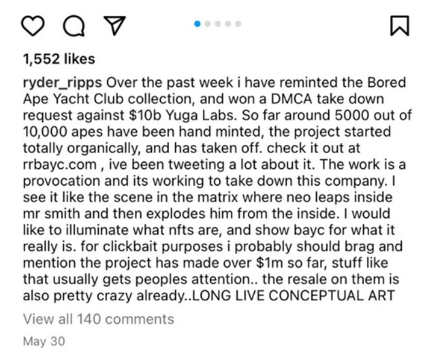

# Yuga Labs, Inc. v. Ripps, No. 22-cv-04355 (C.D. Cal. 2022)

## Summary

[Yuga Labs](https://www.yuga.com/) is the famous creator of the culture-dominating NFT collection [Bored Ape Yacht Club](https://boredapeyachtclub.com/#/) (BAYC), and the subsidiary works springing from it Mutant Ape Yacht Club, Bored Ape Kennel Club, and the forthcoming Otherside metaverse game. BAYC owners include Snoop Dogg, Eminem, Jimmy Fallon, Madonna, Stephen Curry, and Josh Hart, among many others. The market cap of BAYC alone at the time of writing is over $1 billion.&#x20;

[Ryder Ripps](https://twitter.com/ryder\_ripps) is a conceptual artist who has also worked with a number of famous musicians, including [with Kanye West](https://garage.vice.com/en\_us/article/k7a5nv/five-years-of-embajada) at Donda. In May 2022, he created a collection of 10,000 NFTs that are nearly identical to the BAYC collection, although they are titled "RR/BAYC" rather than "Bored Ape Yacht Club." Ripps created this alternative collection, [according to him](https://rrbayc.com/), as a result of his investigation into what he believes are significant [Nazi-related imagery](https://gordongoner.com/) appearing in the BAYC collection. His concept was thus to "recontextualize" the "original BAYC images . . . illuminating truths about their origins and meanings as well as the nature of Web3 – the power of NFTs to change meaning, establish provenance and evade censorship."&#x20;

To obtain one of these "recontextualized" NFTs, users had to visit Ripps' website, read a short description of the project, select a RR/BAYC ape to mint, agree to terms of the mint, and eventually receive the NFT. It looked like this:

<figure><figcaption></figcaption></figure>

Every RR/BAYC available on Ripps page had the same image and number as the original BAYC NFT. After purchase and delivery (assuming Ripps liked "the vibe" of the buyer's wallet), the RR/BAYC NFTs were tradable on major NFT marketplaces, as well as the Ripps-created site [https://apemarket.com/](https://apemarket.com/).&#x20;

Ripps' project ignited something of a firestorm in the media about BAYC and its founders, culminating in this over hour long [YouTube video](https://youtu.be/XpH3O6mnZvw) compilation of much of Ripps' investigative work. This led to [forceful denials](https://twitter.com/GordonGoner/status/1540351103094738947) from [Yuga's founders](https://medium.com/@team\_69582/a-letter-from-the-founders-678e5a3431e7) (who are Cuban, Jewish, Pakistani, and Turkish), and this lawsuit.&#x20;

Yuga's lawsuit, in a surprise to many given Ripps' focus on antisemitic allegations, brings primarily claims under the [Lanham Act](https://en.wikipedia.org/wiki/Lanham\_Act) and related state law for:

1. False Designation of Origin&#x20;
2. False Advertising
3. Cybersquatting
4. Common Law Trademark Infringement
5. Common Law Unfair Competition
6. Statutory Unfair Competition (Cal. Bus. & Prof. Code §§ 17200 et seq.)
7. California False Advertising (Cal. Bus. & Prof. Code §§ 17500 et seq.)
8. Unjust Enrichment
9. Conversion
10. Intentional Interference with Prospective Economic Advantage
11. Negligent Interference with Prospective Economic Advantage

These claims thus all focus on the business aspects of Ripps' activity and the alleged misuse of Yuga's trademarks, rather than defamation or libel. A strategic consideration that may have played into this decision is that by focusing on the alleged business misuse of Yuga's marks, Yuga may be able to obtain its desired result — effectively shutting down Ripps' project — without subjecting itself and its founders to the inevitable discovery that would be required in a defamation lawsuit in which Ripps asserted the defense that his claims were true. (And thus permitting Ripps' lawyers to cross-examine, at least at deposition, each Yuga founder about all manner of their history, after very broad discovery requests.)

Despite the variety of claims above, the facts Yuga chose to focus on really boil down to what it claims is Ripps' wholesale copying of Bored Apes with only the pretext of "recontextualizing" them as "concept art." Instead, Yuga claims, Ripps sought simply to confuse consumers, trade on Yuga's marks, and sell nearly identical NFTs, all of which earned him profits of over $5 million, according to the complaint (¶ 48). The similarity and infringement Yuga identifies is perhaps best illustrated through examples in the Complaint. For example, Yuga shows a side-by-side of an original BAYC and an RR/BAYC listed on OpenSea (¶ 33):

<figure><figcaption></figcaption></figure>

Yuga also highlights a remarkably similar Twitter account (¶ 44):

<figure><figcaption></figcaption></figure>

Yuga further claims (¶ 50) that Ripps' actions were part of continuing smear campaign, and that it was Ripps who "effectively doxxed Yuga Labs' founders by providing their personal identities to well-known media."  (That media report was originally published [here](https://www.buzzfeednews.com/article/katienotopoulos/bored-ape-nft-founder-identity), although the complaint provides no detail on how Ripps would've had this information.) Yuga also highlights this instagram post from Ripps as explaining his motivations:

<figure><figcaption></figcaption></figure>

Yuga focuses on the language about Ripps' actions being an intentional "provocation and its working to take down this company," which adds an edge to its claims about unfair competition and intentional infringement. &#x20;

## Posture

Ripps responded to the suit by filing an extensive motion to strike and/or dismiss the complaint. Ripps' motion focuses on two main theories:

1. Ripps' speech is protected by the First Amendment, and therefore under California's Anti-SLAPP statute all the state law claims fail. (SLAPP stands for Strategic Lawsuit Against Public Participation, i.e., a lawsuit meant to silence a critic despite their clear First Amendment right to speak.)&#x20;
2. Ripps' use of the marks is otherwise protected by Free Speech and nominative use, and thus the trademark infringement claims fail.&#x20;

Ripps' introduction argues placing Ripps' derivative use of marks in their proper context highlights the satirical nature of the work, which he claims Yuga fails to do in the complaint. As an example, he points to the origins of his criticism of the BAYC logo by placing the BAYC logo, the Nazi SS Totenkopf, and Ripps' logo side-by-side:

<figure><figcaption>
Original BAYC at logo at left, Nazi Totenkopf center, and Ripps' derivative logo at right.
</figcaption></figure>

In this context, and under the first theory, Ripps argues (at 19) that California's Anti-SLAPP statute applies because Ripps' speech was "made (1) in furtherance of the constitutional right of free speech and (2) in connection with a public issue." It is free speech, he argues, because it is meant to criticize Yuga and the Bored Ape Yacht Club imagery, which was made explicit in the "terms" when someone requested to mint an RR/BAYC NFT (see above). And it is a public issue, according to Ripps, because of Yuga's and BAYC's prominence in media (which is alleged in the complaint).&#x20;

Ripps' second theory is that the trademark infringement claims are legally insufficient because the controlling legal test is the one first articulated by _Rogers v. Grimaldi_, [875 F.2d 994, 999](https://casetext.com/case/rogers-v-grimaldi#p999) (2d Cir. 1989). That test, as applied by the Ninth Circuit, is that “the trademark owner does not have an actionable Lanham Act claim unless the use of the trademark is 'either (1) not artistically relevant to the underlying work or (2) explicitly misleads consumers as to the source or content of the work.'” _Dr. Seuss Enters., L.P. v. ComicMix LLC_, [983 F.3d 443, 462](https://casetext.com/case/dr-seuss-enters-lp-v-comicmix-llc-9) (9th Cir. 2020) (quoting _VIP Prods. LLC v. Jack Daniel's Props., Inc._ , [953 F.3d 1170, 1174](https://casetext.com/case/vip-prods-llc-v-jack-daniels-props-inc-4#p1174) (9th Cir. 2020)).

Artistic relevance requires only that the use have a "non-zero" relationship to the underlying work, a very low bar. Thus the focus of Ripps' motion is largely on whether, as alleged in the complaint, Ripps explicitly misled consumers about the source of the works. Here, he argues that the _whole point_ of the project was to distinguish itself from Yuga Labs and BAYC, and thus let consumers say "fuck off to @BoredApeYC!" Thus, rather than confusing consumers about the origin of the project, Ripps argues (at 23) consumers could not purchase the RR/BAYC NFTs without understanding they were participating in a protest of BAYC itself:

<figure><figcaption></figcaption></figure>

Additionally, Ripps argues (at 25) that his use is protected by the nominative fair use doctrine. As articulated by the Ninth Circuit, nominative fair use is a defense against trademark infringement claims under the Lanham Act where the defendant can show:

> First, the plaintiff's product or service in question must be one not readily identifiable without use of the trademark; second, only so much of the mark or marks may be used as is reasonably necessary to identify the plaintiff's product or service; and third, the user must do nothing that would, in conjunction with the mark, suggest sponsorship or endorsement by the trademark holder.
>
> _Mattel Inc. v. Walking Mountain Productions_, [353 F.3d 792](https://casetext.com/case/mattel-inc-v-walking-mountain-productions), 810 (9th Cir. 2003)

Ripps argues his use satisfies this test because the point of his work was to criticize BAYC/Yuga, and he could not do so without referencing those trademarks explicitly; he only used the marks to identify them as the source of his protest; and he very clearly disclaimed sponsorship by BAYC — and to the contrary, said they were created by him as a protest _against_ Yuga Labs and BAYC, even according to the allegations of the complaint.

Yuga responded to the motion by countering that, fundamentally, selling products that are identical to a protected trademark (e.g., selling fake Rolex watches by getting customers to agree they are not Rolexes) is no defense at all. To conclude otherwise, Yuga argues, would create a hole in trademark law so big it would swallow the rest of trademark law's intended protections.

The motion is fully briefed and is scheduled for oral argument on November 7, 2022 at 1:30 p.m.

Yuga Labs is represented by [Eric Ball](https://www.fenwick.com/people/eric-ball) and [Kimberly Culp](https://www.fenwick.com/people/kimberly-culp) of Fenwick & West LLP.

Ryder Ripps and Jeremy Cahen are represented by [Louis W. Tompros](https://www.wilmerhale.com/en/people/louis-tompros), [Monica Grewal](https://www.wilmerhale.com/en/people/monica-grewal), and [Scott W. Bertulli](https://www.wilmerhale.com/en/people/scott-bertulli) of Wilmer Cutler Pickering Hale and Dorr LLP.

The judge assigned to the matter is the [Hon. John F. Walter](https://en.wikipedia.org/wiki/John\_F.\_Walter).&#x20;

## Docket

Selected filings are available for free, direct download below. Full court docket is available through PACER, which is most easily accessed through [Court Listener](https://www.courtlistener.com/docket/63458882/yuga-labs-inc-v-ripps/).









## Authors

This article was drafted by [@Lawtoshi](https://twitter.com/lawtoshi).&#x20;
